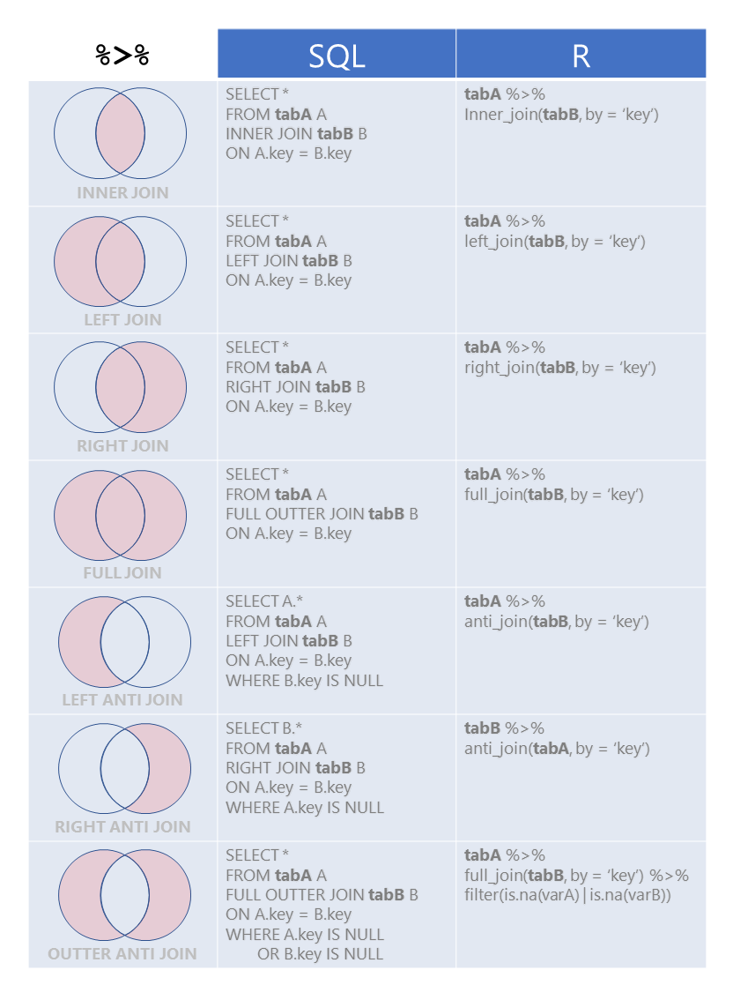

```{r setup, include=FALSE}
knitr::opts_chunk$set(echo = TRUE)
```

## Pacotes

```{r, message=FALSE}
library(tidyverse)
library(lubridate)
library(stringr)
```


## Pipe `%>%`

```{r}
library(magrittr)
```


As duas linhas abaixo são equivalentes:

```{r}
f(x, y)
x %>% f(y)

# como se fosse a notação de função composta na matemática: f o g => f(g(x))
```


Exercício: calcular raiz quadrada da soma dos valores de 1 a 4.

```{r}
x <- c(1, 2, 3, 4)
sqrt(sum(x))
```

Agora escreva esse cálculo utilizando o pipe:

```{r}

```


Exercício mental: imagine 10 funções encaixadas sem o pipe.

SQL:
sum(convert(substring(concat(...))))


### Receita de bolo

Tente entender o que é preciso fazer. 

```{r, eval=FALSE}

esfrie(
  asse(
    coloque(
      bata(
        acrescente(
          recipiente(rep("farinha", 2), "água", "fermento", "leite", "óleo")
          , "farinha", até = "macio"
        ), 
        duração = "3min"
      ), lugar = "forma", tipo = "grande", untada = TRUE
    ), 
    duração = "50min"
  ), 
  "geladeira", "20min")

```

Agora veja como fica escrevendo com o `%>%`:

```{r, eval=FALSE}

recipiente(rep("farinha", 2), "água", "fermento", "leite", "óleo") %>%
  acrescente("farinha", até = "macio") %>%
  bata(duraço = "3min") %>%
  coloque(lugar = "forma", tipo = "grande", untada = TRUE) %>%
  asse(duração = "50min") %>%
  esfrie("geladeira", "20min")
```

Agora o código realmente parece uma receita de bolo.


## Importação 

### Excel

```{r}
# BD: excel com (.) como separador decimal
dados <- readxl::read_excel("../Aula 1/data/bdc.xls", na = c("", "NT", "NA"))

str(dados)
```

```{r, message=FALSe, error=FALSE, warning=FALSE}
# Colocando o tipo das variáveis na mão
dados <- readxl::read_excel("../Aula 1/data/bdc.xls",
                            na = c("", "NT", "NA"),
                            col_types = c("text",
                                          "date",
                                          "guess",
                                          "date",
                                          "text",
                                          rep("numeric", 4),
                                          "text",
                                          rep("numeric", 2),
                                          "text",
                                          rep("numeric", 2),
                                          "text",
                                          "text"))
```

### CSV

```{r}
# BD: csv com (;) e (,) como separador decimal
dados <- readr::read_csv2("../Aula 1/data/bdc.csv", 
                          na = c("", "NT", "NA"),
                          locale = locale(encoding = "utf-8"))
names(dados)
```

### TAB Delim

```{r}
# BD: texto delimitado por tabulação
dados <- readr::read_delim("../Aula 1/data/bdc.txt", delim = "\t")
```

### SQL

```{r, eval = FALSE}
# Criar um banco de dados SQLite

mydb <- DBI::dbConnect(RSQLite::SQLite(), "my-db.sqlite")

DBI::dbWriteTable(mydb, "mtcars", mtcars, overwrite = TRUE)
DBI::dbGetQuery(mydb, 'SELECT * FROM mtcars LIMIT 5')
DBI::dbGetQuery(mydb, 'select * from mtcars where drat > 4')
```


# Mais opções

- https://github.com/rstats-db
- http://db.rstudio.com/

```{r, eval = FALSE}
con <- dbConnect(odbc::odbc(),
                 Driver   = "[your driver's name]",
                 Server   = "[your server's path]",
                 Database = "[your database's name]",
                 UID      = rstudioapi::askForPassword("Database user"),
                 PWD      = rstudioapi::askForPassword("Database password"),
                 Port     = 1433)

# MySQL
# SQLServer
# Oracle
# MongoDB
# Cassandra
# etc
```


### Exercício 

1) Carregue o conteúdo do arquivo `data/infos_processos.rds` num objeto chamado `d_infos`.
2) Carregue o conteúdo do arquivo `data/movs_processos.rds` num objeto chamado `d_movs`.

Dica: O pacote `readr` tem uma ampla gama de funções para importação de dados. escreva `readr::` no console a pressione TAB.


```{r}

```


```{r}
d_infos <- readr::read_rds("data/infos_processos.rds")
d_movs <- readr::read_rds("data/movs_processos.rds")
```


## Manipulação de dados (Data Wrangling)

```{r, echo=FALSE}
knitr::include_graphics("https://raw.githubusercontent.com/hadley/r4ds/master/diagrams/data-science.png")
```


### Sobre o Banco de dados

```{r}
dim(d_infos)
names(d_infos)
glimpse(d_infos)
View(d_infos)

dim(d_movs)
names(d_movs)
glimpse(d_movs)
View(d_movs)
```

```{r, message = FALSE}
library(Hmisc)
describe(d_infos) 

# devtools::install_github("ropenscilabs/skimr") 
# meio chato de instalar por enquanto!
library(skimr)
skim(d_infos)
skim(d_movs)
```


### Diagnóstico das variáveis

```{r}
status <- function(data) {
 n <- data %>% map_dbl(length)
 n_distintos <- data %>% map_dbl(n_distinct)
 n_branco <- data %>% map_dbl(~ sum(str_detect(.x, "^ *$"), na.rm = TRUE))
 n_na <- data %>% map_dbl(~ sum(.x %in% c(NA, ".", "null"), na.rm = TRUE))
 n_zero <- data %>% map_dbl(~ sum(.x %in% 0, na.rm = TRUE))
 classe <- data %>% map_chr(~ class(.x)[1])
 tem_caracteres_estranhos <- data %>% map_lgl(~ any(str_detect(.x, "[^[:print:]]"), na.rm = TRUE))
 maximo_de_caracteres <- data %>% map_dbl(~ max(str_length(.x), na.rm = TRUE))
 
 resp <- data.frame(n,
                    n_distintos,
                    n_branco,
                    n_na,
                    n_zero,
                    classe,
                    tem_caracteres_estranhos,
                    maximo_de_caracteres) %>%
   rownames_to_column("variavel")
 return(resp)
}

d_infos %>% status
d_movs %>% status


# vocabulário
# - map_dbl/map_chr/map_lgl (pacote 'purrr')
# - n_distinct/length
# - str_detect/str_length/regex (pacote stringr)
```


## Arrumando a casa

- Algumas variáveis contém muita informação bruta, que não está no melhor formato possível

### Assunto

- Existem três níveis de assunto do processo que estão codificadas na coluna assunto

```{r}
d_infos %>% 
  count(assunto)
```

```{r}
d_infos <- d_infos %>% 
  separate(
    col = assunto, 
    into = c("assunto_geral", "assunto_intermediario", "assunto"), 
    sep = "-", 
    extra = 'merge', 
    fill = 'right'
  )
```

```{r}
d_infos %>% 
  count(assunto_geral)
# Por que o mesmo assunto aparece duas vezes? Descubram!

d_infos %>% 
  count(assunto_intermediario)
# Por que o mesmo assunto aparece duas vezes? Descubram!

d_infos %>% 
  count(assunto)
# Por que o mesmo assunto aparece duas vezes? Descubram!

```


Tirando espaços indevidos:

```{r}
d_infos <- d_infos %>% 
  mutate(
    assunto_geral = str_trim(assunto_geral),
    assunto_intermediario = str_trim(assunto_intermediario),
    assunto = str_trim(assunto)
  )

```

## Comarca

```{r}
d_infos %>% 
  count(distribuicao)
# Existem subgrupos de câmaras que queremos agrupar
```

```{r}
# Vamos criar novas variáveis
d_infos <- d_infos %>% 
  mutate(extraordinaria = str_detect(distribuicao, "Extraordinária"),
         grupo = case_when(str_detect(distribuicao, "Grupo") ~ "Grupo",
                           str_detect(distribuicao, "Câmara") ~ "Câmara",
                           TRUE ~ "Outro"))
```

```{r}
d_infos %>% 
  count(grupo)

d_infos %>% 
  count(extraordinaria)


# Vocabulário
# - separate (tidyr)
# - mutate (dplyr)
# - case_when (dplyr)
# - str_trim (stringr)
```

## Exercício 

Separe a coluna "origem" em quantas colunas forem necessários.

Dica: não se preocupe em dar o nome correto às colunas por enquanto.


```{r}
d_infos <- d_infos %>%
  separate(col = origem,
                  into = c("Comarca", "Foro", "Vara"),
                  sep = " / ")

d_infos %>%
  count(Comarca, sort = TRUE)

d_infos %>%
  count(Foro, sort = TRUE)

d_infos %>%
  count(Vara, sort = TRUE)
```

## Joins


```{r, echo=FALSE}

```


```{r}
d_movs <- readRDS("../Aula 1/data/movs_processos.rds")
```

```{r}
# ponto importante aqui: group_by + summarise
datas_de_distribuicao <- d_movs %>% 
  mutate(movement = dmy(movement)) %>% 
  group_by(id) %>% 
  summarise(data_de_distribuicao = min(movement))


# só uma parênteses aqui.... vamos falar sobre 'arrange' e 'first'
datas_de_distribuicao2 <- d_movs %>% 
  mutate(movement = dmy(movement)) %>% 
  group_by(id) %>% 
  arrange(movement) %>%
  summarise(data_de_distribuicao = first(movement)) # <- alternativa

teste <- datas_de_distribuicao %>%
  inner_join(datas_de_distribuicao2, by = "id") %>%
  mutate(igual = data_de_distribuicao.x == data_de_distribuicao.y) 

teste %>% View

teste %>% filter(!igual)
```

```{r}
d_infos <- d_infos %>% 
  inner_join(datas_de_distribuicao)

# equivalente a explicitamente adicionar o `by`.
# d_infos <- d_infos %>% 
#   inner_join(datas_de_distribuicao, by = "id")
names(datas_de_distribuicao)
names(d_infos)
```


## Datas

```{r}
library(lubridate)

d_infos <- d_infos %>% 
  mutate(dia_distribuicao = day(data_de_distribuicao),
         mes_distribuicao = month(data_de_distribuicao),
         ano_distribuicao = year(data_de_distribuicao))

glimpse(d_infos)
```

## Exercício

1) Criar a variável duração do processo.


```{r}
d_infos <- d_infos %>%
  mutate(duracao = dmy(data_da_ultima_decisao) - data_de_distribuicao,
         duracao = as.numeric(duracao))


# ou usar o seguinte:
d_infos <- d_infos %>%
  mutate(
    duracao = difftime(data_da_ultima_decisao, data_de_distribuicao, units = "days"),
    duracao = as.numeric(duracao)
    )
# 
# units = c("auto", "secs", "mins", "hours",
#                    "days", "weeks")

```

2) Fazer um gráfico da quantidade de decisões por dia

```{r}

```


```{r}
d_infos %>%
  group_by(data_da_ultima_decisao) %>%
  summarise(qtd = n()) %>%
  ggplot(aes(x = dmy(data_da_ultima_decisao), y = qtd)) +
  geom_col() +
  scale_x_date(limits = dmy(c("01-10-2016", "01-01-2017")))
```

3) Faça uma tabela com a contagem de distribuições por dia da semana (seg, ter, qua, ...). Faça uma coluna com a frequência relativa.
Dica: use `mutate()` e a função `wday()` do lubridate.

```{r}

```


```{r}
d_infos %>%
  mutate(dia_da_semana = wday(data_de_distribuicao, label = TRUE)) %>%
  count(dia_da_semana) %>%
  mutate(p = n/sum(n),
         p_bonito = scales::percent(p))
```

4) Faça um gráfico de barras para descobrir qual é o dia da semana com mais distribuições. Dica: use `mutate()` e a função `wday()` do 
lubridate.

```{r}

```


```{r}
d_infos %>%
  mutate(dia_da_semana = wday(data_de_distribuicao, label = TRUE)) %>%
  ggplot() + 
  geom_bar(aes(x = dia_da_semana))
```


## Construíndo a variável resposta

**ANTES... PAUSA PARA TEORIA**

Sobre o pacote `stringr`

O R básico não tem uma sintaxe legal pra trabalhar com textos.
O pacote `stringr` ajuda a realizar todas as tarefas básicas de manipulação de texto,
exigindo que o usuário estude apenas uma sintaxe.
O `stringr` também é construído sobre a [biblioteca ICU](http://site.icu-project.org/),
implementada em `C` e `C++`, 
apresentando resultados rápidos e confiáveis.

As regras básicas do pacote são:

- As funções de manipulação de texto começam com `str_`. Caso esqueça o nome de uma função, basta digitar `stringr::str_` e apertar `TAB` para ver quais são as opções.
- O primeiro argumento da função é sempre uma `string`.


### Expressões regulares

Expressão regular ou *regex* é uma sequência concisa de caracteres que representa várias strings. Entender o básico de expressões regulares é indispensável para trabalhar com textos.

Vamos estudar expressões regulares através de exemplos e com a função `str_detect()`. Essa função retorna `TRUE` se uma string atende à uma expressão regular e `FALSE` em caso contrário.

A tabela abaixo mostra a aplicação de seis `regex` a seis strings distintas.

```{r}
library(stringr)
palavra <- c('ban', 'banana', 'abandonado', 'pranab anderson', 'BANANA', 'ele levou ban') %>% setNames(palavras)

expressoes <- list(
  'ban', # reconhece tudo que tenha "ban", mas não ignora case
  'BAN', # reconhece tudo que tenha "BAN", mas não ignora case
  regex('ban', ignore_case = TRUE), # reconhece tudo que tenha "ban", ignorando case
  'ban$', # reconhece apenas o que termina exatamente em "ban"
  '^ban', # reconhece apenas o que começa exatamente com "ban"
  'b ?an' # reconhece tudo que tenha "ban", com ou sem espaço entre o "b" e o "a"
) %>% setNames(expressoes)


expressoes %>% map_dfr(~palavras %>% map(str_detect, .x), .id = "regex")
```


```{r}
# Cheat sheet sobre REGEX

knitr::include_graphics("https://www.rstudio.com/wp-content/uploads/2016/09/RegExCheatsheet.pdf")
```


### Informações do pesquisador sobre a variável resposta


1) A votação pode ser unânime (V.U.) ou não 
2) Três resultados possíveis: provido, parcialmente provido, improvido


#### Começando do mais fácil - V.U

```{r}

d_infos <- d_infos %>% 
  mutate(voto_unanime = str_detect(decisao, "V\\.U\\."))


# Essa é uma regex ruim!
d_infos %>% 
  filter(!voto_unanime) %>% 
  select(decisao, voto_unanime) %>% 
  View 
```


```{r}
d_infos <- d_infos %>% 
  mutate(voto_unanime = str_detect(decisao, regex("V\\.? ?U\\.?", ignore_case = TRUE)))

# Ainda não funcionou! Olhe a linha 10.
d_infos %>% 
  filter(!voto_unanime) %>%
  select(decisao, voto_unanime) %>% 
  View
```


```{r}
d_infos <- d_infos %>% 
  mutate(voto_unanime = str_detect(decisao, regex("unanim|V\\.? ?U\\.?", ignore_case = TRUE)))

# Ainda não funcionou! Olhe a linha 17.
d_infos %>% 
  filter(!voto_unanime) %>%
  select(decisao, voto_unanime) %>% 
  View
```


```{r}
d_infos <- d_infos %>% 
  mutate(decisao = rslp:::remove_accents(decisao), 
    voto_unanime = str_detect(decisao, regex("unanim|V\\.? ?U\\.?", ignore_case = TRUE)))

# OK.
d_infos %>% 
  filter(!voto_unanime) %>%
  select(decisao, voto_unanime) %>% 
  View
```


#### Parte mais complicada - provimento

```{r}
regex_parcialmente_provido <- "parcial provimento"
regex_provido <- "recurso provido"
regex_nao_provido <- "negaram provimento"

d_infos <- d_infos %>% 
  mutate(decisao = stringr::str_to_lower(decisao),
         decisao = rslp:::remove_accents(decisao), 
         resultado = case_when(
           stringr::str_detect(decisao, regex_parcialmente_provido) ~ "Parcialmente Provido",
           stringr::str_detect(decisao, regex_provido) ~ "Provido",
           stringr::str_detect(decisao, regex_nao_provido) ~ "Improvido",
           TRUE ~ "Outros"
         ))

# Vocabulário
# - str_to_lower
# - remove_accents
```

```{r}
d_infos %>% 
  count(resultado)
```

## Exercício

1) Coloque uma coluna de proporção na tabela de contingência acima.


2) Aprimore as regex do provido/nao_provido/parcialmente_provido para diminuir a proporção de casos classificados como "Outros". Uma proporção menor do que 20% é aceitável.

Dica: Explore a coluna `decisao` nos casos em que a regex acima classifcou como "Outros".

```{r}

```


### Solução para 1 e 2

```{r}
regex_parcialmente_provido <- "parcial provimento|provimento em parte|provimento parcial"
regex_provido <- "recurso provido|^deram provimento"
regex_nao_provido <- "negaram provimento|nega-se provimento"

d_infos <- d_infos %>%
  mutate(decisao = stringr::str_to_lower(decisao),
         decisao = rslp:::remove_accents(decisao),
         resultado = case_when(
           stringr::str_detect(decisao, regex_parcialmente_provido) ~ "Parcialmente Provido",
           stringr::str_detect(decisao, regex_provido) ~ "Provido",
           stringr::str_detect(decisao, regex_nao_provido) ~ "Improvido",
           TRUE ~ "Outros"
         ))

d_infos %>% 
  count(resultado) %>%
  mutate(p = round(n/sum(n), 2))
```


### Outra Solução (regex mais sofisticado)

```{r}
regex_parcialmente_provido <- "parcial provimento|provimento em parte|provimento parcial"
regex_provido <- "recurso provido|deram provimento (ao|a)|mantiveram o|recursos?( e remessas?( necessaria)? ?)? conhecidos e providos"
regex_nao_provido <- "rejeitaram os embargos|julgaram prejudicado|negaram provimento|nao conheceram|nao providos?"

d_infos <- d_infos %>% 
  mutate(decisao = stringr::str_to_lower(decisao),
         decisao = rslp:::remove_accents(decisao), 
         resultado = case_when(
           stringr::str_detect(decisao, regex_parcialmente_provido) ~ "Parcialmente Provido",
           stringr::str_detect(decisao, regex_provido) ~ "Provido",
           stringr::str_detect(decisao, regex_nao_provido) ~ "Improvido",
           TRUE ~ "Outros"
         ),
         decisao_binaria = ifelse(resultado == "Improvido", "Improvido", "Provido"))


d_infos %>% 
  count(resultado) %>%
  mutate(p = round(n/sum(n), 2))
```


```{r}
d_infos %>% 
  filter(resultado == "Outros") %>% 
  select(decisao) %>%
  View
```


## Análises descritivas das explicativas versus a resposta

primeiro, só a resposta.

```{r}
d_infos %>% 
  count(decisao_binaria) %>%
  mutate(p = round(n/sum(n), 2))
```


```{r}
# position 'stack': dá pra ver contagem, mas não dá pra ver proporção
d_infos %>% 
  count(decisao_binaria, assunto_geral) %>% 
  mutate(assunto_geral = str_wrap(assunto_geral, 15)) %>%
  ggplot(aes(y = n, x = assunto_geral, fill = decisao_binaria)) +
  geom_bar(stat = 'identity', position = 'stack')


# position 'fill': dá pra ver proporção, mas não dá pra ver contagem
d_infos %>% 
  count(decisao_binaria, assunto_geral) %>% 
  mutate(assunto_geral = str_wrap(assunto_geral, 15)) %>%
  ggplot(aes(y = n, x = assunto_geral, fill = decisao_binaria)) +
  geom_bar(stat = 'identity', position = 'fill')

# versão tabela simples
d_infos %>% 
  count(decisao_binaria, assunto_geral) %>%
  spread(decisao_binaria, n, fill = 0) 
  # janitor::ns_to_percents()

# um testezinho chi-quadrado despretensioso
d_infos %>% 
  count(decisao_binaria, assunto_geral) %>%
  spread(decisao_binaria, n, fill = 0) %>%
  filter(Improvido > 0) %>%
  select_if(is.numeric) %>%
  as.matrix %>%
  chisq.test()
```

**PAUSA PARA TEORIA**

## gather e spread

- gather: "Empilha" o banco de dados
- spread: "Joga" uma variável nas colunas
- são funções inversas um do outro

### gather

```{r}
acoes <- tibble(
  tempo = as.Date('2017-01-01') + 0:4,
  ITUB4 = rnorm(5, 0, 1),
  VALE5 = rnorm(5, 0, 2),
  PETR3 = rnorm(5, 0, 4)
)

acoes_gather <- acoes %>% gather(acao, preco, -tempo)

acoes
acoes_gather

# obs: particularmente útil com ggplot2
ggplot(acoes_gather) +
  geom_line(aes(x = tempo, y = preco, colour = acao))
```

### spread

```{r}
acoes_gather %>% spread(acao, preco)
```

tambem conhecido como "pivotar/despivotar", "derreter/condensar", "colunar/descolunar", etc.


## CONTINUANDO as análises descritivas das explicativas versus a resposta

- variável: `extraordinaria`
```{r}
d_infos %>% 
    count(decisao_binaria, extraordinaria) %>% 
    ggplot(aes(y = n, x = extraordinaria,
               fill = decisao_binaria)) +
    geom_bar(stat = 'identity', position = 'fill')
```


- variável: `duracao` (variável contínua!)

```{r}
# Gráfico de barras
d_infos %>%
  mutate(duracao = cut(duracao, breaks = 10, include.lowest = T, dig.lab = 3)) %>% 
  count(decisao_binaria, duracao) %>% 
  ggplot(aes(y = n, x = duracao, fill = decisao_binaria)) +
  geom_bar(stat = 'identity', position = 'fill') +
  theme(axis.text.x = element_text(size = 8, angle = 45, hjust = 1))
```

```{r}
# densidade
d_infos %>%
  ggplot(aes(x = duracao, fill = decisao_binaria)) +
  geom_density(alpha = 0.5) 
```


```{r}
# boxplot
d_infos %>%
  ggplot(aes(y = duracao, x = 1, fill = decisao_binaria)) +
  geom_boxplot() 
```


```{r}
# tabela
d_infos %>%
  group_by(decisao_binaria) %>%
  summarise(n = n(),
            min = min(duracao, na.rm = TRUE),
            media = mean(duracao, na.rm = TRUE),
            desv_pad = sd(duracao, na.rm = TRUE),
            q1 = quantile(duracao, na.rm = TRUE, probs = 0.25),
            mediana = median(duracao, na.rm = TRUE),
            q3 = quantile(duracao, na.rm = TRUE, probs = 0.75),
            max = max(duracao, na.rm = TRUE))
```


```{r}
library(forcats)
# visualizar os assuntos com maior quantidade de resultados 
# positivos
d_infos %>%
  mutate(assunto = assunto %>% as.factor() %>% fct_lump(n = 10)) %>%
  group_by(assunto) %>%
  summarise(
    qtd_processos = n(),
    perc_provido = mean(decisao_binaria == "Provido")
  ) %>%
  mutate(assunto = assunto %>% str_wrap(width = 20) %>% fct_reorder(perc_provido)) %>%
  gather(var, valor, -assunto) %>%
  ggplot(aes(x = assunto, y = valor)) + 
  geom_col() + 
  facet_wrap(~var, scales = "free", ncol = 1)
```


# Exercícios:

1) Identifique os relatores com mais decisoes "Provido" em quantidade e percentualmente.
2) Dependendo do assunto do processo a duração é diferente? Compare apenas entre os assuntos intermediários que mais acontecem.
3) Qual é o Foro com maior número de processos? 
4) Existe diferença no resultado do processo dependendo da classe? Faça um gráfico p/ apresentar os resultados.
5) Em geral os relatores se apresentam sempre na mesma Vara? Faça um gráfico p/ apresentar os resultados.
6) Existe diferença na duração dos processos entre as Comarcas? Faça um gráfico p/ apresentar os resultados.
7) Qual é o primeiro nome mais comum entre os relatores e revisores? Faça um gráfico p/ apresentar os resultados.
8) Qual é o número médio de palavras do texto da decisão por assunto? Faça um gráfico p/ apresentar os resultados.
9) Existem pares de revisores e relatores que analisaram mais de 10 processos juntos?
10) Quantos assuntos distintos são julgados em cada vara? Faça um gráfico p/ apresentar os resultados.


## Extras

### mutate-group_by

- tabelas de bivars com summarise e spread


### transformações úteis no mutate/summarise

- cut/cut2/cut_interval/cut_number/cut_width/Hmisc::cut2
- estatísticas: media/mediana/desvio padrao/max/min/quantil
- matemáticas: log/sqrt/resto/sin/cos
- lógicas: ==/>/</!=
- posicional: last/first/nth
- deslocamento: lead/lag
- janeladas: cumsum/cumprod/cummin/cummax/cummean/RcppRoll::*


# Anexos

```{r, eval = FALSE}
dataset <- readr::read_rds("data/d_cposg.rds")

informacoes <- dataset %>% 
  select(id, data) %>% 
  unnest(data) %>% 
  spread(data, value) %>% 
  janitor::clean_names() %>% 
  abjutils::rm_accent_from_names()

decisoes <- dataset %>% 
  select(id, decisions) %>% 
  unnest(decisions) %>% 
  group_by(id) %>%
  filter(date == max(date))

movs <- dataset %>% 
  select(id, movs) %>% 
  unnest(movs) %>% 
  mutate(movement = format(movement, "%d/%m/%Y"))
  #group_by(id) %>% 
  #Wsummarise(data_de_distribuicao = min(movement))

processos <- readRDS("../Aula 1/data/processos_pra_pegar.rds")

d_infos <- informacoes %>% 
  inner_join(decisoes) %>% 
  #inner_join(movs) %>% 
  filter(area == "Criminal",
         id %in% processos,
         !distribuicao %in% c("5ª Câmara de Direito Criminal D", "Órgão Especial"),
         situacao %in% c("Encerrado", "Julgado", "Transitado")
         # Tiramos o "administrativamente" porque são casos em que não há julgamento do mérito
         ) %>% 
  select(-x, -outros_numeros, -numeros_de_origem, -processo, -ultima_carga, -volume_apenso) %>% 
  rename(data_da_ultima_decisao = date,
         decisao = decision) %>% 
  mutate(data_da_ultima_decisao = format(data_da_ultima_decisao, "%d/%m/%Y")
         #data_de_distribuicao = format(data_de_distribuicao, "%d/%m/%Y")
  )

saveRDS(d_infos, 'data/infos_processos.rds')
saveRDS(movs,  'data/movs_processos.rds')
```
