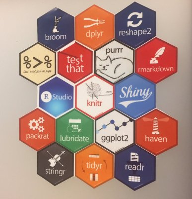

```{r setup, include=FALSE}
knitr::opts_chunk$set(echo = TRUE)
```

## Curso-R

- Athos Damiani
- Daniel Falbel
- Fernando Correa 
- Julio Trecenti
- William Amorim

## Curso-R

```{r, echo=FALSE, fig.align='center', fig.width=4, fig.height=4}
knitr::include_graphics("foto_curso_r2.jpg")
```

## Ciência de dados

```{r, echo=FALSE, fig.align='center', fig.width=4, fig.height=4}
knitr::include_graphics("bigdata2.png")
```


## Papel do R

R é a grande cola.

**Exemplo:** Tensorflow, feito em Python, chamado no R pelo pacote keras.

```{r, eval = FALSE}
library(keras)

modelo <- keras_model(input = 1)
```

## Nosso curso

16/09 - Introdução + R base - Fernando 

16/09 - Vetores + R base - Athos

23/09 - Dplyr - Julio

23/09 - ggplot2 - Daniel

## Nosso curso

Nosso curso se baseia no livro *R for data science*:

http://r4ds.had.co.nz

O melhor lugar para aprender sobre o `tidyverse` depois do Curso-R.

```{r, echo=FALSE}
knitr::include_graphics("https://raw.githubusercontent.com/hadley/r4ds/master/diagrams/data-science.png")
```

## Nosso curso

O material do curso está disponível nessa página (em desenvolvimento):

http://material.curso-r.com/

Também temos um blog:

http://curso-r.com/blog/


## Dinâmica

- Almoço às 12h.
- Aulas expositivas em blocos de 3h.
- Exercícios ao decorrer e no final das aulas.
- Leituras e exercícios complementares e opcionais fora da sala de aula.

<!-- ## Requisitos básicos  -->

<!-- - Lógica de programação. -->

<!-- - Veja essa apresentação de aprox. 10 min (slides: 13 ao 43): -->

<!-- http://curso-r.github.io/slides/aula_00_01_apresentacao.html  -->

<!-- - Leia esse post de blog (aprox. 5 min): -->

<!-- https://blog.rstudio.org/2016/09/15/tidyverse-1-0-0/ -->

<!-- - Se quiser ganhar tempo, crie uma conta no Github. -->

## Não vamos falar de

- Modelagem estatística (regressões, testes estatísticos, clustering, componentes principais)

- Gráficos dinâmicos e dashboards (Shiny, htmlwidgets)

- Programação eficiente com R (paralelização, *profiling*, `Rcpp`)

- Não vamos nos aprofundar em "big data" (Spark, Hadoop, MongoDB, TensorFlow)

## Tidyverse

O universo arrumadinho.

Revolução do R. Quem mexia em R antes de 2012 nota uma diferença gigante.

```{r, echo=FALSE}
library(magrittr)

# magick::image_read("https://pbs.twimg.com/media/CvzEQcfWIAAIs-N.jpg") %>%
#   magick::image_scale("400x400+8-8") %>%
  # magick::image_write("abc.jpg")
```

## Princípios do tidyverse

- *Eficiência algorítmica vs eficiência de trabalho*. O tempo gasto pensando em como realizar uma operação é mais importante do que o tempo que o computador gasta para realizar um cálculo.

- *Tidy data*. Princípio para arrumação de base de dados que resolve 90% dos problemas reais. Base tidy:
    - Cada observação é uma linha do bd.
    - Cada variável é uma coluna do bd.
    - Cada dado está numa célula do bd.


## Princípios do tidyverse

- Utilização do operador *pipe*: `%>%`.

    > "No matter how complex and polished the individual operations are, it is often the quality of the glue that most directly determines the power of the system."  
    > -- Hal Abelson

## Estrutura do tidyverse

- *Aparato mnemônico*. Pacotes baseados em teoria e API consistentes.

- *Minimalidade e funções puras*. Funções sem efeitos colaterais. Inputs e Outputs consistentes. Encaixa perfeitamente com o uso do pipe (%>%).

- *procedimentos* para ciência de dados.

## GitHub

- Maior plataforma online para compartilhar códigos. 
- Utiliza o **Git**, a melhor ferramenta de versionamento de software.

*Vantagens*:

1. Boa prática de organizar projetos pois mantém os códigos organizados e atualizados na web.

2. Projetos colaborativos: aumenta a produtividade e permite que pessoas de todo lugar ajudem nos projetos. 

3. O `tidyverse` só é o que é hoje por conta do *social coding*.


## GitHub

Um tutorial para começar a [usar Github no RStudio rapidamente](http://curso-r.com/blog/2017/07/17/2017-07-17-rstudio-e-github/)

Para detalhes, faça o [data science toolbox](https://www.coursera.org/learn/data-scientists-tools)


## Exercício da aula zero

Anotar em uma folha de papel ou virtual:

- http://material.curso-r.com/
- Tidyverse
- pipe (%>%)
- Github
