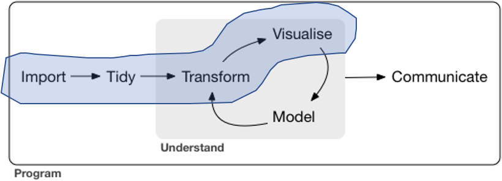
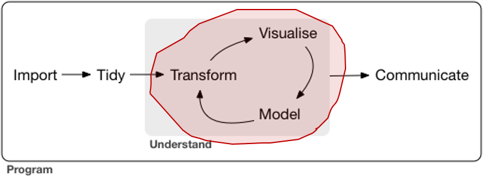

## Recapitulação da Aula 1

- pipe
- RMarkdown
- Importação dos dados
- Diagnóstico inicial
- Limpeza dos dados
- Descritivas: tabelas de contingência e gráficos
- Preparação da variável resposta
- regex, gather/spread, dplyr, tidyr, stringr, lubridate.

```{r, echo=FALSE}

```


## Exercícios da Aula 1. Dúvidas?

```{r}
library(tidyverse)
d_infos <- readr::read_rds("data/d_infos_tratado.rds")
```

1) Identifique os relatores com mais decisoes "Provido" em quantidade e percentualmente.

```{r}
d_infos %>%
  group_by(relator) %>%
  summarise(n = n(),
            n_provido = sum(decisao_binaria == "Provido"),
            p_provido = n_provido / n) %>%
  filter(n_provido == max(n_provido) | p_provido == max(p_provido)) %>%
  # filter(n > 5) %>%
  arrange(desc(n_provido), desc(p_provido))
```

2) Dependendo do assunto do processo a duração é diferente? Compare apenas entre os assuntos intermediários que mais acontecem.

```{r}
library(forcats)
library(stringr)

d_infos %>%
  mutate(duracao = as.numeric(duracao),
         assunto_intermediario = assunto_intermediario %>% 
           str_wrap(12) %>% 
           fct_reorder(duracao) %>% 
           fct_lump(5, other_level = "Outro")) %>%
  # filter(duracao < 4000) %>%
  ggplot() +
  geom_boxplot(aes(x = assunto_intermediario, y = duracao)) +
  coord_flip()
```

3) Qual é o Foro com maior número de processos? 

```{r}
d_infos %>% 
  separate(origem, c("comarca", "foro", "vara"), sep = " / ") %>% 
  count(comarca, foro, sort = TRUE)
```

4) Existe diferença no resultado do processo dependendo da classe? Faça um gráfico p/ apresentar os resultados.
5) Em geral os relatores se apresentam sempre na mesma Vara? Faça um gráfico p/ apresentar os resultados.
6) Existe diferença na duração dos processos entre as Comarcas? Faça um gráfico p/ apresentar os resultados.
7) Qual é o primeiro nome mais comum entre os relatores e revisores? Faça um gráfico p/ apresentar os resultados.
8) Qual é o número médio de palavras do texto da decisão por assunto? Faça um gráfico p/ apresentar os resultados.
9) Existem pares de revisores e relatores que analisaram mais de 10 processos juntos?
10) Quantos assuntos distintos são julgados em cada vara? Faça um gráfico p/ apresentar os resultados.

<!-- ----------------------------------------------------------------------- -->

## Aula 2

```{r, echo=FALSE}

```

- Pré-processamentos
- criação de variáveis

<!-- 1h00' OK -->
- Setup
- Exercicios anteriores
- Revisao (principalmente ggplot2)

<!-- 1h30' OK -->
- Conceitos
- erros de ajuste vs. erros de predição
- Sobreajuste (Overfiting)

<!-- 3h00' -->
- regressão logística (nao esquecer de falar de formula)
    - ajustar um modelo
    - mude a formula
- árvore de decisão
    - ajustar um modelo
    - plotar a arvore
- matriz de confusão, tpr, fpr
    - fazer a tabela de acertos na base de teste
- curva ROC
    - ajustar uma curva ROC
    - comparar acerto dos modelos usando vários critérios (AUC, acerto)

<!-- ----------------------------------------------------------------------- -->

<!-- 5h00' FALTA bagging, rf xgboost -->
- Validação cruzada (cross-validation)
- regularização (LASSO)
- bagging (conceituação teórica)
- LASSO
    - ajustar um lasso
- random forest
    - ajustar um rf
- xgboost
    - ajustar um xgboost

<!-- 6h00' OK -->
- communicate
    - flexdashboards
    - API
        - captcha

<!-- ----------------------------------------------------------------------- -->


```{r}
d_infos %>% 
  count(resultado, decisao_binaria)
```


### Arrumação da base


```{r}

library(stringr)

# processos <- readRDS("../Aula 1/data/processos_pra_pegar.rds")
# RAW
# d_cjsg <- read_rds("data/d_cjsg.rds") %>% 
#  mutate(n_processo = str_replace_all(n_processo, "[^0-9]", ""))

dataset <- read_rds("../Aula 1/data/d_cposg.rds")

partes <- dataset %>% 
  select(id, parts) %>% 
  unnest(parts) %>% 
  filter(part %in% c("Apelante", "Apelado"), role != "Advogado") %>% 
  # juntar casos com múltiplas partes
  group_by(id, id1, part) %>% 
  summarise(name = paste(name, collapse = "\n")) %>% 
  ungroup() %>%
  # classificacao de tipo de pessoa
  mutate(tipo_part = case_when(
    str_detect(name, "Minist|Justi") ~ "MP",
    TRUE ~ "pessoa"
  )) %>% 
  # em alguns casos, existem pessoas no polo passivo e ativo. 
  # vamos considerar só um (simplificacao)
  distinct(id, part, tipo_part) %>% 
  spread(part, tipo_part) %>% 
  janitor::clean_names() %>% 
  filter(!is.na(apelante)) %>% 
  select(id, autor = apelante)

informacoes <- dataset %>% 
  semi_join(partes, "id") %>% 
  select(id, data) %>% 
  unnest(data) %>% 
  spread(data, value) %>% 
  janitor::clean_names() %>% 
  abjutils::rm_accent_from_names() %>% 
  filter(str_detect(distribuicao, "de Direito Criminal|Extraord")) %>% 
  separate(origem, c("comarca", "foro", "vara"), 
           sep = " / ", extra = "merge", fill = "right") %>% 
  mutate(foro_origem = fct_lump(foro, 10)) %>% 
  separate(assunto, c("assunto_geral", "assunto_intermediario", "assunto"), 
    sep = "-", extra = 'merge', fill = 'right'
  ) %>% 
  mutate_at(vars(assunto, assunto_intermediario), funs(str_trim)) %>% 
  select(id, assunto_intermediario, assunto, camara = distribuicao, 
         foro_origem, relator)

tempos <- dataset %>% 
  semi_join(partes, "id") %>% 
  select(id, movs) %>% 
  unnest(movs) %>% 
  filter(movement < Sys.Date(), movement > as.Date("2000-01-01")) %>% 
  group_by(id) %>% 
  summarise(n_movs = n(),
            tempo = as.numeric(max(movement) - min(movement)))

  
# Varias regex
re_vu <- regex("unanim|V\\.? ?U\\.?", ignore_case = TRUE)
re_negaram <- regex("negaram|improc|improv|mantiv|não prov", ignore_case = TRUE)
re_parcial <- regex("parcial|em parte", ignore_case = TRUE)
re_extin <- regex("extin|prejud", ignore_case = TRUE)
re_nulo <- regex("anul|nul[ia]|dilig|conhec", ignore_case = TRUE)
re_deram <- regex("deram|provim|acolher", ignore_case = TRUE)

# todos os tipos de outros
outros <- c("Extinto", "Anul., Dilig., Nao Conhec.", "Outros")

decisoes <- dataset %>% 
  select(id, decisions) %>% 
  unnest(decisions) %>% 
  inner_join(partes, "id") %>% 
  arrange(desc(date)) %>% 
  filter(!is.na(decision)) %>% 
  distinct(id, .keep_all = TRUE) %>% 
  mutate(
    unanime = if_else(str_detect(decision, re_vu), "Unanime", "Nao Unanime"),
    decisao = case_when(
      str_detect(decision, re_negaram) & autor == "MP" ~ "Favoravel",
      str_detect(decision, re_negaram) & autor == "pessoa" ~ "Desfavoravel",
      str_detect(decision, re_parcial) ~ "Parcialmente",
      str_detect(decision, re_extin) ~ "Extinto",
      str_detect(decision, re_nulo) ~ "Anul., Dilig., Nao Conhec.",
      str_detect(decision, re_deram) & autor == "MP" ~ "Desfavoravel",
      str_detect(decision, re_deram) & autor == "pessoa" ~ "Favoravel",
      TRUE ~ "Outros"
    ),
    decisao_bin = case_when(
      decisao %in% c("Favoravel", "Parcialmente") ~ "Favoravel",
      (decisao %in% outros & autor == "MP") ~ "Favoravel",
      (decisao %in% outros & autor == "pessoa") ~ "Desfavoravel",
      TRUE ~ "Desfavoravel"
    )
  ) %>% 
  select(id, decisao_bin, decisao, autor, unanime)


d_final <- decisoes %>% 
  inner_join(tempos, "id") %>% 
  inner_join(informacoes, "id") %>% 
  distinct(id, .keep_all = TRUE) %>% 
  mutate(decisao_bin = factor(decisao_bin))
```


```{r}
set.seed(10)
treino <- d_final %>% 
  sample_n(18000)
teste <- d_final %>% 
  anti_join(treino, "id")


m <- glm(decisao_bin ~ autor + unanime + 
           n_movs + tempo + assunto + camara +
           foro_origem, 
         data = teste, family = binomial())

m %>% 
  broom::augment(newdata = teste, type.predict = "response") %>% 
  filter(!is.na(.fitted)) %>% 
  mutate(res = if_else(.fitted > .5, "Favoravel", "Desfavoravel")) %>% 
  summarise(prop = sum(res == decisao_bin) / n()) %>% 
  with(prop)

d_final %>% 
  count(decisao_bin) %>% 
  mutate(prop = n/sum(n))

saveRDS(d_final, "data/d_final.rds")

```


```{r}
# dataset <- readr::read_rds("data/d_cposg.rds")
# 
# d_infos <- informacoes %>% 
#   inner_join(decisoes) %>% 
#   #inner_join(movs) %>% 
#   filter(area == "Criminal",
#          id %in% processos,
#          !distribuicao %in% c("5ª Câmara de Direito Criminal D", "Órgão Especial"),
#          situacao %in% c("Encerrado", "Julgado", "Transitado")
#          # Tiramos o "administrativamente" porque são casos em que não há julgamento do mérito
#          ) %>% 
#   select(-x, -outros_numeros, -numeros_de_origem, -processo, -ultima_carga, -volume_apenso) %>% 
#   rename(data_ultima_decisao = date,
#          decisao = decision) %>% 
#   mutate(data_ultima_decisao = format(data_ultima_decisao, "%d/%m/%Y")
#          #data_dist = format(data_dist, "%d/%m/%Y")
#   )
# 
# saveRDS(d_infos, 'data/infos_processos.rds')
# saveRDS(movs,  'data/movs_processos.rds')
```

# Modelagem


## O que é treinar o modelo?

Encontrar uma função $f$ nesta equação:

$$
y = f(X) + \epsilon
$$

em que:

- $y$ é o que queremos explicar: variável resposta,
- $X$ são as informações que explicam: matriz de variáveis explicativas e
- $\epsilon$ é um ruído aleatório.

## Como obter uma f?


Definimos uma estrutura genérica (modelo) para $f$ e ajustamos para os dados obtidos.

- Regressão linear
- Regressão logística
- Árvore de decisão
- Misturando vários modelos (segunda parte da aula)
    - Bagging
    - Boosting
    - Florestas Aleatórias


## Regressão linear

Suposição de que $f(X)$ é da forma:

$$
f(X) = \alpha + \beta X
$$

## Regressão polinomial

Suposição de que $f(X)$ é da forma:

$$
f(X) = \alpha + \beta_1 X + \beta_2 X^2 + ... + \beta_k X^k
$$

## Overfitting

- Propósito da modelagem:
  - Construir um modelo que erre pouco
- Em linhas gerais, modelos ruins são modelos que erram
- Erro de generalização

$$\text{Overfitting = baixo erro na amostra}\nRightarrow\text{baixo erro no mundo}$$


# Exemplo


```{r}

library(ggplot2)
library(magrittr)
set.seed(5)

x <- runif(10)
y <- 2*x + rnorm(10)
```


$$Y = 2X + \epsilon$$
```{r}

data.frame(x = x, y = y) %>%
  ggplot(aes(x = x, y = y)) +
  geom_point() +
  geom_smooth(method = "lm", formula = y ~ x, color = "red", se = FALSE) +
  theme_bw()

```

```{r}
# Como ajustar modelos lineares

modelo_linear <- lm(y ~ x)
```

```{r}
# Como extrair os valores preditos

modelo_linear$fitted.values
```

```{r}
# Erro observado

mean((modelo_linear$fitted.values - y)^2)
```

Existe um modelo que erra menos na amostra?

```{r}

data.frame(x = x, y = y) %>%
  ggplot(aes(x = x, y = y)) +
  geom_smooth(method = "lm", formula = y ~ poly(x, 9), color = "blue", se = FALSE) +
  geom_smooth(method = "lm", formula = y ~ x, color = "red", se = FALSE) +
  theme_bw() +
  geom_point(size = 4)

```

```{r}
# Erro do modelo

modelo_polinomial <- lm(y ~ poly(x, 9))
mean((modelo_polinomial$fitted.values - y)^2)
```

Esse modelo é realmente melhor?


```{r}
x_novo <- runif(5)
y_novo <- 2*x_novo + rnorm(5)

dados_novos <- tibble(x_novo, y_novo)

data.frame(x = x, y = y) %>%
  ggplot(aes(x = x, y = y)) +
  geom_smooth(method = "lm", formula = y ~ poly(x, 9), color = "blue", se = FALSE) +
  geom_smooth(method = "lm", formula = y ~ x, color = "red", se = FALSE) +
  theme_bw() +
  geom_point(size = 4) +
  geom_point(aes(x = x_novo, y = y_novo), color = "orange", size = 4, data = dados_novos)
```

```{r}
cat("Erro do modelo linear: \n")
mean((predict(modelo_linear, data.frame(x = x_novo)) - y_novo)^2)

cat("Erro do modelo polinomial: \n")
mean((predict(modelo_polinomial, data.frame(x = x_novo)) - y_novo)^2)
```

Conclusão: Modelo complicados (demais) são piores do que modelos simples

<!-- ----------------------------------------------------------------------- -->

## Como não deixar o modelo complicado (demais)?

- Nessa bloco da aula:
    - Separe a base em dois pedaços e ajuste o modelo em um só
- No próximo bloco da aula:
    - regularização
    - validação cruzada

## Regressão linear parruda

Suposição de que a média de $Y|X$ é $g(X)$

$$
\text{Média}[Y|X] = g(\beta X + \alpha) + \epsilon
$$

Quando $g$ é constante, o modelo parrudo equivale ao modelo linear simples.

## Regressão Logística

- Modelo parrudo e muito utilizado
- $Y$ tem que estar em $\{0,1\}$

$$
\frac{\text{Média}[Y|X]}{1-\text{Média}[Y|X]} = \exp(\beta X + \alpha)
$$
- $g(t) = \frac{\exp(t)}{1+\exp(t)}$

### dados

```{r}
# Separando a nossa base em treino e teste
set.seed(11071995)
n <- 2000
teste <- d_final %>% 
  sample_n(n)

treino <- d_final %>% 
  anti_join(teste, by = 'id')
```

## regressão parruda: glm

```{r}
m <- glm(decisao_bin ~ autor + unanime + 
           n_movs + tempo + assunto + camara +
           foro_origem, 
         data = teste, family = binomial())
```


## O que é um modelo bom?

```{r}
# plugando o score na base
teste <- teste %>%
  mutate(predito = as.vector(predict(m, newdata = ., type = "response"))) %>% filter(!is.na(predito))
```

classificar usando a média da base

```{r}
# tabela de confundimento
teste <- teste %>%
  mutate(classe_predita = if_else(predito > 0.5, "Favoravel", "Desfavoravel"))
tab_de_conf <- table(teste$decisao_bin, teste$classe_predita)
tab_de_conf
```

```{r}
# acurácia
acc <- sum(diag(tab_de_conf))/sum(tab_de_conf)
acc
```

Mas e se fizessemos classe predita = 1 pra todo mundo?

```{r}
# tabela de confundimento
teste <- teste %>%
  mutate(um_pra_todo_mundo = "Desfavoravel")

tab_de_conf_degenerada <- table(teste$decisao_bin, teste$um_pra_todo_mundo)
tab_de_conf_degenerada
```

```{r}
# acurácia
acc <- sum(diag(tab_de_conf_degenerada)) / sum(tab_de_conf_degenerada)
acc
```


## Alternativas para medir desempenho do modelo logístico

- KS
- Curva ROC / AUC
- (um monte de outras, mas menos comum)


## Área sobre a curva ROC

```{r}
knitr::include_graphics("confusion_matrix.png")
```

Atenção! Uma pequena confusão:

- Sensibilidade é TRUE POSITIVE RATE
    - Probabilidade de estar certo quando disse que é "Favorável"
- Especificidade é 1 - TRUE NEGATIVE RATE
    - Probabilidade de estar certo quando disse que é "Desfavorável"

```{r}
tpr <- function(real, predito, corte = 0.5) {
  sum(predito >= corte & real == "Favoravel") / sum(real == "Favoravel")
}

tnr <- function(real, predito, corte) {
  sum(predito <= corte & real == "Desfavoravel") / sum(real == "Desfavoravel")
}
with(teste, tpr(decisao_bin, predito, 0.5))
```

Curva ROC

um monte de "matriz de confundimento". No exemplo, 100 delas.

```{r}
df <- teste

cortes <- seq(0, 1, l = 100)
TPR_modelo <- sapply(cortes, function(x) tpr(df$decisao_bin, df$predito, x))
FPR_modelo <- sapply(cortes, function(x) 1-tnr(df$decisao_bin, df$predito, x))

TPR_aleatorio <- sapply(cortes, function(x) tpr(df$decisao_bin, rep(1, length(df$predito)), x))
FPR_aleatorio <- sapply(cortes, function(x) 1-tnr(df$decisao_bin, rep(1, length(df$predito)), x))

data.frame(
  tipo = rep(c("modelo", "aleatorio"), each = length(cortes)),
  TPR = c(TPR_modelo, TPR_aleatorio),
  FPR = c(FPR_modelo, FPR_aleatorio)
) 

tibble(
  TPR = TPR_modelo,
  FPR = FPR_modelo
) %>%
  ggplot(aes(x = FPR, y = TPR)) +
  geom_line() +
  geom_abline(slope = 1, intercept = 0, colour = "red") +
  theme_bw()
```

```{r}
m <- glm(decisao_bin ~ autor + unanime + 
           n_movs + tempo + assunto + camara +
           foro_origem, 
         data = teste, family = binomial())
```


