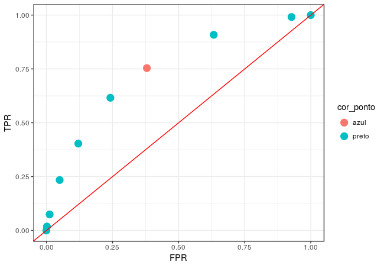
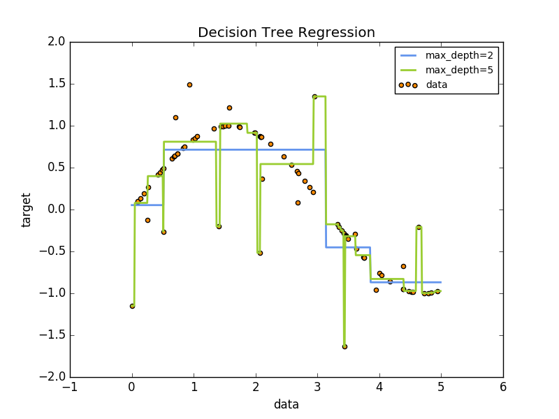

## Recapitulação da Aula 1

- pipe
- RMarkdown
- Importação dos dados
- Diagnóstico inicial
- Limpeza dos dados
- Descritivas: tabelas de contingência e gráficos
- Preparação da variável resposta
- regex, gather/spread, dplyr, tidyr, stringr, lubridate.

```{r, echo=FALSE}
knitr::include_graphics("ciclo_aula1.png")
```

## Exercícios da Aula 1. Dúvidas?

```{r}
library(tidyverse)
d_infos <- readr::read_rds("../Aula 1/data/d_infos_tratado.rds")
```

1) Identifique os relatores com mais decisoes "Provido" em quantidade e percentualmente.

```{r}
d_infos %>%
  group_by(relator) %>%
  summarise(n = n(),
            n_provido = sum(decisao_binaria == "Provido"),
            p_provido = n_provido / n) %>%
  filter(n_provido == max(n_provido) | p_provido == max(p_provido)) %>%
  # filter(n > 5) %>%
  arrange(desc(n_provido), desc(p_provido))
```

2) Dependendo do assunto do processo a duração é diferente? Compare apenas entre os assuntos intermediários que mais acontecem.

```{r}
library(forcats)
library(stringr)

d_infos %>%
  mutate(duracao = as.numeric(duracao),
         assunto_intermediario = assunto_intermediario %>% 
           str_wrap(12) %>% 
           fct_reorder(duracao) %>% 
           fct_lump(5, other_level = "Outro")) %>%
  # filter(duracao < 4000) %>%
  ggplot() +
  geom_boxplot(aes(x = assunto_intermediario, y = duracao)) +
  coord_flip()
```

3) Qual é o Foro com maior número de processos? 

```{r}
d_infos %>% 
  separate(origem, c("comarca", "foro", "vara"), sep = " / ") %>% 
  count(comarca, foro, sort = TRUE)
```

4) Existe diferença no resultado do processo dependendo da classe? Faça um gráfico p/ apresentar os resultados.
5) Em geral os relatores se apresentam sempre na mesma Vara? Faça um gráfico p/ apresentar os resultados.
6) Existe diferença na duração dos processos entre as Comarcas? Faça um gráfico p/ apresentar os resultados.
7) Qual é o primeiro nome mais comum entre os relatores e revisores? Faça um gráfico p/ apresentar os resultados.
8) Qual é o número médio de palavras do texto da decisão por assunto? Faça um gráfico p/ apresentar os resultados.
9) Existem pares de revisores e relatores que analisaram mais de 10 processos juntos?
10) Quantos assuntos distintos são julgados em cada vara? Faça um gráfico p/ apresentar os resultados.

<!-- ----------------------------------------------------------------------- -->

## Aula 2

```{r, echo=FALSE}
knitr::include_graphics("ciclo_aula2.png")
```

<!-- 1h00' OK -->
- Setup
- Exercicios anteriores
- Revisao (principalmente ggplot2)

<!-- 1h30' OK -->
- Conceitos
- erros de ajuste vs. erros de predição
- Sobreajuste (Overfiting)

<!-- 3h00' -->
- regressão logística (nao esquecer de falar de formula)
    - ajustar um modelo
    - mude a formula
- árvore de decisão
    - ajustar um modelo
    - plotar a arvore
- matriz de confusão, tpr, fpr
    - fazer a tabela de acertos na base de teste
- curva ROC
    - ajustar uma curva ROC
    - comparar acerto dos modelos usando vários critérios (AUC, acerto)

<!-- ----------------------------------------------------------------------- -->

# Modelagem

## O que é treinar um modelo?

Encontrar uma função $f$ nesta equação:

$$
y = f(X) + \epsilon
$$

em que:

- $y$ é o que queremos explicar: variável resposta,
- $X$ são as informações que explicam: matriz de variáveis explicativas e
- $\epsilon$ é um ruído aleatório.

## Como obter uma f?

Definimos uma estrutura genérica (modelo) para $f$ e ajustamos para os dados obtidos.

- Regressão linear
- Regressão logística
- Árvore de decisão
- Misturando vários modelos (segunda parte da aula)
    - Bagging
    - Boosting
    - Florestas Aleatórias

## Regressão linear

Suposição de que $f(X)$ é da forma:

$$
f(X) = \alpha + \beta X
$$

## Como estimar $\alpha$ e $\beta$?

$\alpha$ e $\beta$ são escolhidos de tal forma que:

$$
\sum_{i = 1}^{n} [y_i - (\alpha + \beta x_i)]^2
$$

## Regressão polinomial

Suposição de que $f(X)$ é da forma:

$$
f(X) = \alpha + \beta_1 X + \beta_2 X^2 + ... + \beta_k X^k
$$

## Overfitting

- Propósito da modelagem:
  - Construir um modelo que erre pouco
- Em linhas gerais, modelos ruins são modelos que erram
- Erro de generalização

$$\text{Overfitting = baixo erro na amostra}\nRightarrow\text{baixo erro no mundo}$$


# Exemplo


```{r}

library(ggplot2)
library(magrittr)
set.seed(5)

x <- runif(10)
y <- 2*x + rnorm(10)
```


$$Y = 2X + \epsilon$$
```{r}

data.frame(x = x, y = y) %>%
  ggplot(aes(x = x, y = y)) +
  geom_point() +
  geom_smooth(method = "lm", formula = y ~ x, color = "red", se = FALSE) +
  theme_bw()

```

```{r}
# Como ajustar modelos lineares

modelo_linear <- lm(y ~ x)
```

```{r}
# Como extrair os valores preditos

modelo_linear$fitted.values
```

```{r}
# Erro observado

mean((modelo_linear$fitted.values - y)^2)
```

Existe um modelo que erra menos na amostra?

```{r}

data.frame(x = x, y = y) %>%
  ggplot(aes(x = x, y = y)) +
  geom_smooth(method = "lm", formula = y ~ poly(x, 9), color = "blue", se = FALSE) +
  geom_smooth(method = "lm", formula = y ~ x, color = "red", se = FALSE) +
  theme_bw() +
  geom_point(size = 4)

```

```{r}
# Erro do modelo

modelo_polinomial <- lm(y ~ poly(x, 9))
mean((modelo_polinomial$fitted.values - y)^2)
```

Esse modelo é realmente melhor?


```{r}
set.seed(11071995)

x_novo <- runif(5)
y_novo <- 2*x_novo + rnorm(5)

dados_novos <- tibble(x_novo, y_novo)

data.frame(x = x, y = y) %>%
  ggplot(aes(x = x, y = y)) +
  geom_smooth(method = "lm", formula = y ~ poly(x, 9), color = "blue", se = FALSE) +
  geom_smooth(method = "lm", formula = y ~ x, color = "red", se = FALSE) +
  theme_bw() +
  geom_point(size = 4) +
  geom_point(aes(x = x_novo, y = y_novo), color = "orange", size = 4, data = dados_novos)
```

```{r}
cat("Erro do modelo linear: \n")
mean((predict(modelo_linear, data.frame(x = x_novo)) - y_novo)^2)

cat("Erro do modelo polinomial: \n")
mean((predict(modelo_polinomial, data.frame(x = x_novo)) - y_novo)^2)
```

Conclusão: Modelo complicados (demais) são piores do que modelos simples

<!-- ----------------------------------------------------------------------- -->

## Como não deixar o modelo complicado (demais)?

- Nessa bloco da aula:
    - Separe a base em dois pedaços e ajuste o modelo em um só
- No próximo bloco da aula:
    - regularização
    - validação cruzada


```{r}
library(ggplot2)
library(magrittr)
library(dplyr)
library(purrr)
library(tidyr)
set.seed(2)

# dados --------------------------------------------------------------
censo <- readRDS("data/censo.rds")
censo %<>% mutate(base = ifelse(runif(n()) > 0.3, "treino", "teste"))

# visualização -------------------------------------------------------
censo %>%
  filter(base == "treino") %>%
  ggplot(aes(x = escolaridade, y = renda)) +
  geom_point(size = 3) +
  theme_gray(14)

dispersao_escolaridade_x_renda
```


# Exercício

- Ajuste polinômios de graus de 1 a 12 e compare os seus erros de predição na base de teste. Qual é o melhor?

```{r}
ajusta_polinomio <- function(n) {
  lm(renda ~ poly(escolaridade, n), data = censo %>% filter(base == "treino"))
}

reqm <- function(modelo, particao) {
  dados <- censo %>% filter(base == particao)
  observado <- dados$renda
  esperado <- predict(modelo, newdata = dados)

  sqrt(mean((observado - esperado)^2))
}

```


## Regressão linear parruda

Suposição de que a média de $Y|X$ é $g(X)$

$$
\text{Média}[Y|X] = g(\beta X + \alpha) + \epsilon
$$

Quando $g$ é constante, o modelo parrudo equivale ao modelo linear simples.

## Regressão Logística

- Modelo parrudo e muito utilizado
- $Y$ tem que estar em $\{0,1\}$

$$
\frac{\text{Média}[Y|X]}{1-\text{Média}[Y|X]} = \exp(\beta X + \alpha)
$$
- $g(t) = \frac{\exp(t)}{1+\exp(t)}$

### Voltando para a base de semana passada...

```{r}
# Separando a nossa base em treino e teste
set.seed(11071995)
n <- 5000
teste <- d_final %>% 
  sample_n(n)

treino <- d_final %>% 
  anti_join(teste, by = 'id')
```

## regressão parruda: glm

```{r}
m <- glm(decisao_bin ~ autor + unanime + 
           n_movs + tempo + assunto + num_camara +
           foro_origem, 
         data = teste, family = binomial())
```


## O que é um modelo bom?

```{r}
# plugando o score na base
teste <- teste %>%
  mutate(predito = as.vector(predict(m, newdata = ., type = "response"))) %>% filter(!is.na(predito))
```

classificar usando a média da base

```{r}
# tabela de confundimento
teste <- teste %>%
  mutate(classe_predita = if_else(predito > 0.5, "Favoravel", "Desfavoravel"))
tab_de_conf <- table(teste$decisao_bin, teste$classe_predita)
tab_de_conf
```

```{r}
# acurácia
acc <- sum(diag(tab_de_conf))/sum(tab_de_conf)
acc
```

Mas e se fizessemos classe predita = 1 pra todo mundo?

```{r}
# tabela de confundimento
teste <- teste %>%
  mutate(um_pra_todo_mundo = "Desfavoravel")

tab_de_conf_degenerada <- table(teste$decisao_bin, teste$um_pra_todo_mundo)
tab_de_conf_degenerada
```

```{r}
# acurácia
acc <- sum(diag(tab_de_conf_degenerada)) / sum(tab_de_conf_degenerada)
acc
```


## Alternativas para medir desempenho do modelo logístico

- Curva ROC / AUC
- (um monte de outras, mas menos comum)

## Área sobre a curva ROC

```{r}
knitr::include_graphics("confusion_matrix.png")
```

Atenção! Uma pequena confusão:

- Sensibilidade é TRUE POSITIVE RATE
    - Probabilidade de estar certo quando disse que é "Favorável"
- Especificidade é 1 - TRUE NEGATIVE RATE
    - Probabilidade de estar certo quando disse que é "Desfavorável"

```{r}
tpr <- function(real, predito, corte = 0.5) {
  sum(predito >= corte & real == "Favoravel") / sum(real == "Favoravel")
}

tnr <- function(real, predito, corte) {
  sum(predito <= corte & real == "Desfavoravel") / sum(real == "Desfavoravel")
}
with(teste, tpr(decisao_bin, predito, 0.5))
with(teste, tnr(decisao_bin, predito, 0.5))
```

Curva ROC

um monte de matrizes de confundimento. No exemplo, 100 delas.

```{r}
df <- teste

cortes <- seq(0, 1, l = 100)
TPR_modelo <- sapply(cortes, function(x) tpr(df$decisao_bin, df$predito, x))
FPR_modelo <- sapply(cortes, function(x) 1-tnr(df$decisao_bin, df$predito, x))

tibble(
  TPR = TPR_modelo,
  FPR = FPR_modelo
) %>%
  ggplot(aes(x = FPR, y = TPR)) +
  geom_line() +
  geom_point(size = 1) + 
  geom_abline(slope = 1, intercept = 0, colour = "red") +
  theme_bw()
```

## Exercício

No gráfico abaixo, encontra o corte associado ao ponto pintado de vermelho claro.

```{r}

```


# Interações: coeficientes que variam quando cruzamos variáveis

```{r}
m <- glm(decisao_bin ~ autor + unanime + 
           n_movs + tempo + assunto + num_camara:tipo_camara + 
           foro_origem, 
         data = teste, family = binomial())
```

Originalmente:

$$\text{Média}[Y|X, \text{Câmara 1 Criminal Comum}] = \text{Média}[Y|X, \text{Câmara 1 Extraordinaria}]$$

Agora:

$$\text{Média}[Y|X, \text{Câmara 1 Criminal Comum}] \neq \text{Média}[Y|X, \text{Câmara 1 Extraordinaria}]$$


```{r}
teste <- teste %>%
  mutate(predito = as.vector(predict(m, newdata = ., type = "response"))) %>% filter(!is.na(predito))

teste <- teste %>%
  mutate(classe_predita = if_else(predito > 0.5, "Favoravel", "Desfavoravel"))
tab_de_conf <- table(teste$decisao_bin, teste$classe_predita)
tab_de_conf
```

```{r}
acc <- sum(diag(tab_de_conf))/sum(tab_de_conf)
acc
```

Acurácia ficou igual...

Vamos tentar colocar mais assuntos

```{r}
teste_com_mais_variaveis <- teste %>% 
  mutate(assunto = ifelse(str_detect(assunto, "Homicídio|Latrocínio"), "Homicídio", assunto),
         assunto = ifelse(str_detect(assunto, "Roubo"), "Roubo", assunto),
         assunto = ifelse(str_detect(assunto, "Furto"), "Furto",
                          assunto),
         assunto = ifelse(str_detect(assunto, "Estupro"), "Esturpo", assunto),
         assunto = ifelse(str_detect(assunto, "[tT]ráfico"), "Tráfico", assunto),
         assunto = fct_lump(assunto, n = 10)) 
```

## Exercíco 3

Ajuste um modelo com esse novo assunto e compare os resultados com o modelo anterior. Está melhor do que antes?


```{r}
m <- glm(decisao_bin ~ autor + unanime + assunto + num_camara + n_movs + tempo + idade + num_decision, 
         data = teste_com_mais_variaveis, family = binomial())
```


```{r}
teste_com_mais_variaveis <- teste_com_mais_variaveis %>%
  mutate(predito = as.vector(predict(m, newdata = ., type = "response"))) %>% filter(!is.na(predito))

teste_com_mais_variaveis <- teste_com_mais_variaveis %>%
  mutate(classe_predita = if_else(predito > 0.5, "Favoravel", "Desfavoravel"))
tab_de_conf <- table(teste_com_mais_variaveis$decisao_bin, teste_com_mais_variaveis$classe_predita)
tab_de_conf
```

```{r}
acc <- sum(diag(tab_de_conf))/sum(tab_de_conf)
acc
```

```{r}
with(teste_com_mais_variaveis, tpr(decisao_bin, predito, 0.5))
with(teste_com_mais_variaveis, tnr(decisao_bin, predito, 0.5))
```

```{r}
df <- teste

cortes <- seq(0, 1, l = 100)
TPR_modelo <- sapply(cortes, function(x) tpr(df$decisao_bin, df$predito, x))
FPR_modelo <- sapply(cortes, function(x) 1-tnr(df$decisao_bin, df$predito, x))

roc_glm <- tibble(
  TPR = TPR_modelo,
  FPR = FPR_modelo
)

roc_glm %>%
  ggplot(aes(x = FPR, y = TPR)) +
  geom_line() +
  geom_abline(slope = 1, intercept = 0, colour = "red") +
  theme_bw()
```


# Segunda tentativa de modelo de classificação: árvores

```{r}

```

```{r}
library(rpart)
library(rpart.plot)

arvore <- rpart(decisao_bin ~ autor + unanime + assunto + num_camara + n_movs + tempo + idade + num_decision, data = teste_com_mais_variaveis)
rpart.plot(arvore)
```

```{r}
teste_com_mais_variaveis <- teste_com_mais_variaveis %>%
  mutate(predito = predict(arvore, newdata = .)[,2]) %>% filter(!is.na(predito))

teste_com_mais_variaveis <- teste_com_mais_variaveis %>%
  mutate(classe_predita = if_else(predito > 0.5, "Favoravel", "Desfavoravel"))
tab_de_conf <- table(teste_com_mais_variaveis$decisao_bin, teste_com_mais_variaveis$classe_predita)
tab_de_conf
```

```{r}
acc <- sum(diag(tab_de_conf))/sum(tab_de_conf)
acc
```

```{r}
with(teste_com_mais_variaveis, tpr(decisao_bin, predito, 0.5))
with(teste_com_mais_variaveis, tnr(decisao_bin, predito, 0.5))
```

```{r}
df <- teste_com_mais_variaveis

cortes <- seq(0, 1, l = 100)
TPR_modelo <- sapply(cortes, function(x) tpr(df$decisao_bin, df$predito, x))
FPR_modelo <- sapply(cortes, function(x) 1-tnr(df$decisao_bin, df$predito, x))

tibble(
  TPR = TPR_modelo,
  FPR = FPR_modelo,
  modelo = "Árvore"
) %>%
  bind_rows(mutate(roc_glm, modelo = "GLM")) %>% 
  ggplot(aes(x = FPR, y = TPR, color = modelo)) +
  geom_line() +
  #geom_abline(slope = 1, intercept = 0, colour = "red") +
  theme_bw()
```

- Conclusão: a árvore é pior.
