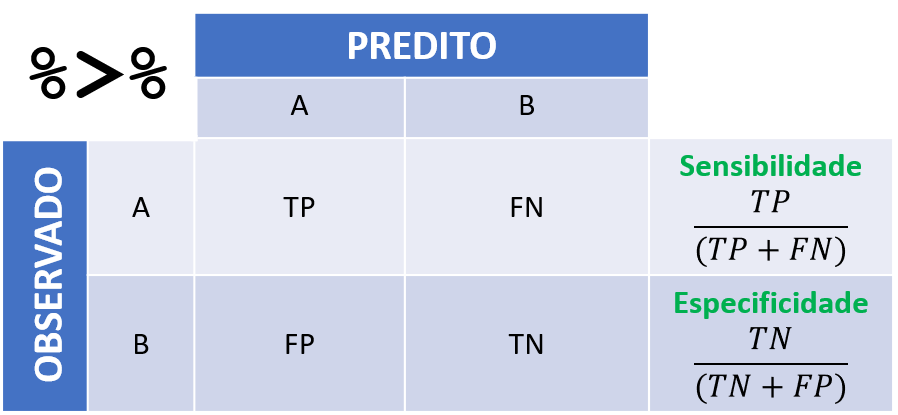
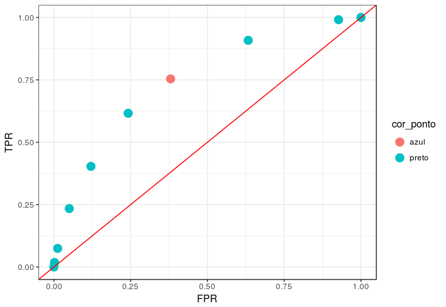
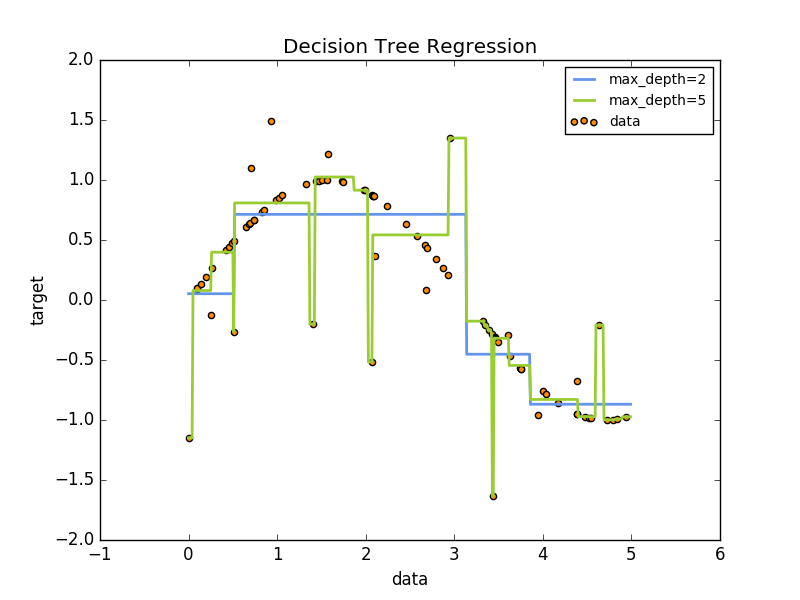

## Recapitulação da Aula 1

- pipe
- RMarkdown
- Importação dos dados
- Diagnóstico inicial
- Limpeza dos dados
- Descritivas: tabelas de contingência e gráficos
- Preparação da variável resposta
- regex, gather/spread, dplyr, tidyr, stringr, lubridate.


```{r, echo=FALSE}
knitr::include_graphics("ciclo_aula2.png")
```

## Exercícios da Aula 1. Dúvidas?

```{r}
library(tidyverse)
d_infos <- readr::read_rds("data/d_infos_tratado.rds")

d_infos
```

1) Identifique os relatores com mais decisoes "Provido" em quantidade e percentualmente.

```{r}
d_infos %>%
  group_by(relator) %>%
  summarise(distribuicao = first(distribuicao),
            n = n(),
            n_provido = sum(decisao_binaria == "Provido"),
            p_provido = n_provido / n) %>%
  filter(n_provido == max(n_provido) | 
           p_provido == max(p_provido)) %>%
  # filter(n > 5) %>%
  arrange(desc(n_provido), desc(p_provido))
```

2) Dependendo do assunto do processo a duração é diferente? Compare apenas entre os assuntos intermediários que mais acontecem.

```{r}
library(forcats)
library(stringr)
d_infos %>%
  mutate(duracao = as.numeric(duracao)) %>% 
  filter(duracao > 0) %>% 
  mutate(assunto_intermediario = assunto_intermediario %>% 
           str_wrap(12) %>% 
           fct_reorder(duracao) %>% 
           fct_lump(5, other_level = "Outro")) %>%
  # filter(duracao < 4000) %>%
  ggplot() +
  aes(x = assunto_intermediario, y = duracao) +
  geom_boxplot() +
  coord_flip()
```

3) Qual é o Foro com maior número de processos? 

```{r}
d_infos %>% 
  separate(origem, c("comarca", "foro", "vara"), sep = " / ") %>%
  count(comarca, foro, sort = TRUE) %>% 
  arrange(desc(n))
```

4) Existe diferença no resultado do processo dependendo da classe? Faça um gráfico p/ apresentar os resultados.
5) Em geral os relatores se apresentam sempre na mesma Vara? Faça um gráfico p/ apresentar os resultados.
6) Existe diferença na duração dos processos entre as Comarcas? Faça um gráfico p/ apresentar os resultados.
7) Qual é o primeiro nome mais comum entre os relatores e revisores? Faça um gráfico p/ apresentar os resultados.
8) Qual é o número médio de palavras do texto da decisão por assunto? Faça um gráfico p/ apresentar os resultados.
9) Existem pares de revisores e relatores que analisaram mais de 10 processos juntos?
10) Quantos assuntos distintos são julgados em cada vara? Faça um gráfico p/ apresentar os resultados.

<!-- ----------------------------------------------------------------------- -->

## Aula 2

```{r, echo=FALSE}
knitr::include_graphics("ciclo_aula2.png")
```

<!-- ----------------------------------------------------------------------- -->

## Plano de hoje

<!-- 1h00' -->
- setup
- exercicios anteriores
- revisao (principalmente ggplot2)
- pré-processamentos
- criação de variáveis

<!-- 3h00' -->
- regressão logística (nao esquecer de falar de formula)
    - ajustar um modelo
    - mudar a formula
- árvore de decisão
    - ajustar um modelo
    - plotar a arvore
    
- matriz de confusão, tpr, fpr
    - fazer a tabela de acertos na base de teste
    - erros de ajuste vs. erros de predição
    - Sobreajuste (Overfiting)
- curva ROC
    - ajustar uma curva ROC
    - comparar acerto dos modelos usando vários critérios (AUC, acerto)

<!-- 5h00' -->
- regularização (LASSO)
- Validação cruzada (cross-validation)
- LASSO
    - ajustar um lasso
- random forest
    - ajustar um rf
- Desafio!

<!-- 6h00' -->
- communicate
    - flexdashboards
    - API
        - captcha

<!-- ----------------------------------------------------------------------- -->

## Arrumação da base

### Base inicial (da aula 1)

```{r}
dataset <- read_rds("../Aula 1/data/d_cposg.rds")

dataset
```

### Base das partes

Nessa base, separamos os casos iniciados pelos acusados ou pelo Ministério Público. Também simplificamos os tipos de processos possíveis.

```{r}
partes <- dataset %>% 
  select(id, parts) %>% 
  unnest(parts) %>% 
  filter(part %in% c("Apelante", "Apelado"), 
         role != "Advogado") %>% 
  # juntar casos com múltiplas partes
  group_by(id, id1, part) %>% 
  summarise(name = paste(name, collapse = "\n")) %>% 
  ungroup() %>%
  # classificacao de tipo de pessoa
  mutate(tipo_part = case_when(
    str_detect(name, "Minist|Justi") ~ "MP",
    TRUE ~ "pessoa"
  )) %>% 
  # em alguns casos, existem pessoas no polo passivo e ativo. 
  # vamos considerar só um (simplificacao)
  distinct(id, part, tipo_part) %>% 
  spread(part, tipo_part) %>% 
  janitor::clean_names() %>% 
  filter(!is.na(apelante)) %>% 
  select(id, autor = apelante)
partes
```

### Base de informações

A mesma da aula passada, com algumas modificações

Exercício: comentar o código abaixo.

```{r}
# devtools::install_github('abjur/abjutils')

informacoes <- dataset %>% 
  semi_join(partes, "id") %>% 
  select(id, data) %>% 
  unnest(data) %>% 
  spread(data, value) %>% 
  janitor::clean_names() %>% 
  abjutils::rm_accent_from_names() %>% 
  filter(str_detect(distribuicao, "de Direito Criminal|Extraord")) %>% 
  separate(origem, c("comarca", "foro", "vara"), 
           sep = " / ", extra = "merge", fill = "right") %>% 
  mutate(foro_origem = fct_lump(foro, 10)) %>% 
  separate(assunto, c("assunto_geral", "assunto_intermediario", "assunto"), 
    sep = "-", extra = 'merge', fill = 'right'
  ) %>% 
  mutate_at(vars(assunto, assunto_intermediario), funs(str_trim)) %>% 
  mutate(tipo_camara = if_else(str_detect(distribuicao, "Extra"), 
                               "Extraordinaria", "Ordinaria")) %>% 
  mutate(num_camara = str_extract(distribuicao, "^[0-9]+"),
         num_camara = str_pad(num_camara, 2, "0", side = "left")) %>% 
  select(id, assunto, num_camara, tipo_camara, foro_origem, relator) %>%
  replace_na(list(assunto = "nenhum")) %>%
  mutate(assunto = case_when(
    str_detect(assunto, "Tráfico de Drogas") ~ "Tráfico de drogas",
    str_detect(assunto, "Posse de Drogas") ~ "Posse de drogas",
    TRUE ~ as.character(assunto)
  )) %>% 
  mutate(assunto = fct_lump(assunto, 30),
         relator = fct_lump(relator, 30))
```

### Base dos tempos

Obtém a idade do processo.

```{r}
tempos <- dataset %>% 
  semi_join(partes, "id") %>% 
  select(id, movs) %>% 
  unnest(movs) %>% 
  filter(movement < Sys.Date(), movement > as.Date("2000-01-01")) %>%
  group_by(id) %>% 
  summarise(n_movs = n(),
            comeco = min(movement),
            idade = as.numeric(Sys.Date() - comeco))
```

### Base das decisoes

Uma classificação um pouco mais sofisticada do que a da aula anterior. 

```{r}
# Varias regex
re_vu <- regex("unanim|V\\.? ?U\\.?", ignore_case = TRUE)
re_negaram <- regex("negaram|improc|improv|mantiv|não prov", ignore_case = TRUE)
re_parcial <- regex("parcial|em parte", ignore_case = TRUE)
re_extin <- regex("extin|prejud", ignore_case = TRUE)
re_nulo <- regex("anul|nul[ia]|dilig|conhec", ignore_case = TRUE)
re_deram <- regex("deram|provim|acolher", ignore_case = TRUE)

# todos os tipos de outros
outros <- c("Extinto", "Anul., Dilig., Nao Conhec.", "Outros")

decisoes <- dataset %>% 
  select(id, decisions) %>% 
  unnest(decisions) %>% 
  inner_join(partes, "id") %>% 
  arrange(desc(date)) %>% 
  filter(!is.na(decision)) %>% 
  group_by(id) %>% 
  mutate(num_decision = n()) %>% 
  ungroup() %>% 
  distinct(id, .keep_all = TRUE) %>% 
  mutate(
    unanime = if_else(str_detect(decision, re_vu), "Unanime", "Nao Unanime"),
    decisao = case_when(
      str_detect(decision, re_negaram) & autor == "MP" ~ "Favoravel",
      str_detect(decision, re_negaram) & autor == "pessoa" ~ "Desfavoravel",
      str_detect(decision, re_parcial) ~ "Parcialmente",
      str_detect(decision, re_extin) ~ "Extinto",
      str_detect(decision, re_nulo) ~ "Anul., Dilig., Nao Conhec.",
      str_detect(decision, re_deram) & autor == "MP" ~ "Desfavoravel",
      str_detect(decision, re_deram) & autor == "pessoa" ~ "Favoravel",
      TRUE ~ "Outros"
    ),
    decisao_bin = case_when(
      decisao %in% c("Favoravel", "Parcialmente") ~ "Favoravel",
      (decisao %in% outros & autor == "MP") ~ "Favoravel",
      (decisao %in% outros & autor == "pessoa") ~ "Desfavoravel",
      TRUE ~ "Desfavoravel"
    )
  ) %>% 
  select(id, decisao_bin, decisao, autor, unanime, num_decision)
```

### Base de textos / ementas

Nova base de dados! Utiliza as informações da base de dados de ementas.

```{r}
blacklist <- c(
  "desprovido", "provido", "improvido", "apelo nao", "improcedente",
  "provimento", "negado", "manutencao do decidido", "parcialmente", 
  "parcial", "provimento", "mantidos", "mente", "acolhido", "mantida",
  "absolvicao", "condenacao"
) %>% str_c(collapse = "|")

d_cjsg <- read_rds("data/d_cjsg.rds") %>%
  mutate(id = str_replace_all(n_processo, "[^0-9]", "")) %>% 
  filter(str_detect(classeassunto, "Apela")) %>% 
  semi_join(decisoes, "id") %>% 
  select(id, ementa) %>% 
  distinct(id, .keep_all = TRUE) %>% 
  # limpando o texto
  mutate(ementa = ementa %>% 
           str_to_lower() %>% 
           tm::removeWords(tm::stopwords("pt")) %>% 
           abjutils::rm_accent() %>% 
           str_replace_all(blacklist, "") %>% 
           str_replace_all("[[:space:]]+", " ")) %>% 
  filter(!is.na(ementa))

textos <- d_cjsg %>% 
  tidytext::unnest_tokens(word, ementa, 
                          token = "ngrams", n = 2) %>% 
  count(id, word) %>% 
  group_by(word) %>% 
  mutate(n = n()) %>% 
  ungroup() %>% 
  filter(n >= 500) %>% 
  mutate(um = 1) %>% 
  select(-n) %>%
  rename(txt = word) %>% 
  spread(txt, um, fill = 0, sep = "_") %>% 
  janitor::clean_names() 
  # purrr::set_names(paste0("txt_", names(.))) %>% 
  # rename(id = txt_id)


textos
```

### Dados finais

Dados finais para ajustar modelo. Observe a parte dos fatores.

```{r}
d_final <- decisoes %>% 
  inner_join(tempos, "id") %>% 
  inner_join(informacoes, "id") %>% 
  left_join(textos, "id") %>% 
  mutate_at(vars(starts_with("txt_")), 
            funs(if_else(is.na(.), 0, .))) %>% 
  mutate_if(is.character, as.factor) %>% 
  select(decisao_bin, autor, n_movs, idade, assunto, 
         num_camara, tipo_camara, foro_origem, relator,
         starts_with("txt"))

saveRDS(d_final, "data/d_final.rds")
d_final
```

### Base de treino e base de teste

```{r}
d_final <- readRDS("data/d_final.rds")

set.seed(19910401)
treino_ids <- sample(seq_len(nrow(d_final)), 18000)
treino <- d_final[treino_ids, ]
teste <- d_final[-treino_ids, ]
```

<!-- ----------------------------------------------------------------------- -->

## Modelagem prática

### O objeto formula

`formula` é um tipo especial de objeto no R que ajuda muito na especificação dos modelos. Ela tem a forma `y ~ x1 + x2 + ... + xn` em que `y` é o nome da variável resposta e `x1, x2, ..., xn` são os nomes das variáveis que serão utilizadas como explicativas.

```{r}
f <- decisao_bin ~ autor + n_movs + idade + assunto + 
           num_camara + tipo_camara + foro_origem + relator
```

### Modelo trivial

```{r}
# modelo trivial

predizer <- function(x) "Desfavoravel"

teste %>% 
  mutate(res = predizer(.)) %>% 
  summarise(prop = sum(res == decisao_bin) / n()) %>% 
  pull(prop)
```

1. Exercício

Por quê esse é o modelo mais simples que um agente racional poderia fazer?

### Regressão logística

```{r}
logistica <- glm(f, data = treino, family = binomial())

# taxa de acerto
teste %>%
  mutate(res = predict(logistica, newdata = teste, 
                       type = "response"),
         res = if_else(res > .5, "Favoravel", "Desfavoravel")) %>% 
  summarise(prop = sum(res == decisao_bin) / n()) %>% 
  pull(prop)
```

#### Exercício

1. Tente mudar a formula adicionando ou tirando variáveis.

2. Use as funções `summary` e `anova` para descobrir as variáveis mais importantes. O que está acontecendo com o summary?

3. Teste a função `broom::tidy(logistica)` e explique o que ela faz.

### Árvore de decisão

```{r}
# só para visualizar melhor
treino_arvore <- treino %>% 
  mutate(assunto = as.factor(as.numeric(assunto))) 
teste_arvore <- teste %>% 
  mutate(assunto = as.factor(as.numeric(assunto)))

arvore <- rpart::rpart(decisao_bin ~ ., data = treino_arvore, 
                       minsplit = 10, minbucket = 2, 
                       xval = 30, cp = 0.005)

rpart.plot::rpart.plot(arvore)

# taxa de acerto
teste_arvore %>% 
  mutate(res = predict(arvore, newdata = ., type = "class")) %>% 
  summarise(prop = sum(res == decisao_bin) / n()) %>% 
  pull(prop)
```

#### Exercício

1. Tente obter uma taxa de acerto maior mudando os parâmetros da árvore.

2. Se você já está manjando tudo, veja as funções `plotcp` e `prune`.

<!-- ----------------------------------------------------------------------- -->

## Modelagem

<!-- ----------------------------------------------------------------------- -->

### O que é treinar um modelo?

Encontrar uma função $f$ nesta equação:

$$
y = f(X) + \epsilon
$$

em que:

- $y$ é o que queremos explicar: variável resposta,
- $X$ são as informações que explicam: matriz de variáveis explicativas e
- $\epsilon$ é um ruído aleatório.

### Como obter uma f?

Definimos uma estrutura genérica (modelo) para $f$ e ajustamos para os dados obtidos.

- Regressão linear
- Regressão logística
- Árvore de decisão
- Misturando vários modelos (segunda parte da aula)
    - Bagging
    - Boosting
    - Florestas Aleatórias

## Regressão linear

Suposição de que $f(X)$ é da forma:

$$
f(X) = \alpha + \beta X
$$

## Como estimar $\alpha$ e $\beta$?

$\alpha$ e $\beta$ são escolhidos de tal forma que:

$$
\sum_{i = 1}^{n} [y_i - (\alpha + \beta x_i)]^2
$$

Suposição de que $f(X)$ é da forma:

$$
f(X) = \alpha + \beta_1 X + \beta_2 X^2 + ... + \beta_k X^k
$$

### Overfitting

- Propósito da modelagem:
  - Construir um modelo que erre pouco
- Em linhas gerais, modelos ruins são modelos que erram
- Erro de generalização

$$\text{Overfitting = baixo erro na amostra}\nRightarrow\text{baixo erro no mundo}$$


## Exemplo

```{r}
set.seed(5)
x <- runif(10)
y <- 2*x + rnorm(10)
```

$$Y = 2X + \epsilon$$

```{r}
data.frame(x = x, y = y) %>%
  ggplot(aes(x = x, y = y)) +
  geom_point() +
  geom_smooth(method = "lm", formula = y ~ x, color = "red", se = FALSE) +
  theme_bw()
```

```{r}
# Como ajustar modelos lineares
modelo_linear <- lm(y ~ x)
```

```{r}
modelo_linear
```


```{r}
# Como extrair os valores preditos
modelo_linear$fitted.values
```

```{r}
# Erro observado
mean((modelo_linear$fitted.values - y)^2)
```

Existe um modelo que erra menos na amostra?

```{r}

data.frame(x = x, y = y) %>%
  ggplot(aes(x = x, y = y)) +
  geom_smooth(method = "lm", formula = y ~ poly(x, 9), 
              color = "blue", se = FALSE) +
  geom_smooth(method = "lm", formula = y ~ x, 
              color = "red", se = FALSE) +
  theme_bw() +
  geom_point(size = 4)

```

```{r}
# Erro do modelo
modelo_polinomial <- lm(y ~ poly(x, 9))
mean((modelo_polinomial$fitted.values - y)^2)
```

```{r}
poly(x, 9)
```


Esse modelo é realmente melhor?

```{r}
dados_novos %>% 
  class()
```


```{r}
set.seed(11071995)

x_novo <- runif(5)
y_novo <- 2*x_novo + rnorm(5)

dados_novos <- tibble(x_novo, y_novo)

data.frame(x = x, y = y) %>%
  ggplot(aes(x = x, y = y)) +
  geom_smooth(method = "lm", formula = y ~ poly(x, 9), 
              color = "blue", se = FALSE) +
  geom_smooth(method = "lm", formula = y ~ x, 
              color = "red", se = FALSE) +
  theme_bw() +
  geom_point(size = 4) +
  geom_point(aes(x = x_novo, y = y_novo), 
             color = "orange", size = 4, data = dados_novos)
```

```{r}
cat("Erro do modelo linear: \n")
mean((predict(modelo_linear, data.frame(x = x_novo)) - y_novo)^2)

cat("Erro do modelo polinomial: \n")
mean((predict(modelo_polinomial, data.frame(x = x_novo)) - y_novo)^2)
```

Conclusão: Modelo complicados (demais) são piores do que modelos simples

<!-- ----------------------------------------------------------------------- -->

## Como não deixar o modelo complicado (demais)?

- Nesse bloco da aula:
    - Separe a base em dois pedaços e ajuste o modelo em um só
- No próximo bloco da aula:
    - regularização
    - validação cruzada

```{r}
library(ggplot2)
library(magrittr)
library(dplyr)
library(purrr)
library(tidyr)
set.seed(2)

# dados --------------------------------------------------------------
censo <- readRDS("data/censo.rds")
censo %<>% mutate(base = ifelse(runif(n()) > 0.3, "treino", "teste"))

# visualização -------------------------------------------------------
censo %>%
  filter(base == "treino") %>%
  ggplot(aes(x = escolaridade, y = renda)) +
  geom_point(size = 3) +
  theme_gray(14)
```


# Exercício

- Ajuste polinômios de graus de 1 a 12 e compare os seus erros de predição na base de teste. Qual é o melhor?

```{r}


ajusta_polinomio <- function(n) {
  lm(renda ~ poly(escolaridade, n), data = censo %>% filter(base == "treino"))
}

reqm <- function(modelo, particao) {
  dados <- censo %>% filter(base == particao)
  observado <- dados$renda
  esperado <- predict(modelo, newdata = dados)

  sqrt(mean((observado - esperado)^2))
}

modelo <- ajusta_polinomio(n = 4)
reqm(modelo, "teste")

modelo <- ajusta_polinomio(n = 3)
reqm(modelo, "teste")

modelo <- ajusta_polinomio(n = 2)
reqm(modelo, "teste")

modelo <- ajusta_polinomio(n = 1)
reqm(modelo, "teste")

for(i in 1:12){
  modelo <- ajusta_polinomio(n = i)
  
  reqm(modelo, "treino")
}

reqm(modelo, "teste")


purrr::map_dfr(1:12, ~ {
  m <- ajusta_polinomio(.x)
  tibble(
    erro_treino = reqm(m, "treino"),
    erro_teste = reqm(m, "teste")
  )
}, .id = "grau") %>%
  mutate(grau = as.numeric(grau)) %>% 
  gather(tipo_erro, erro, -grau) %>% 
  ggplot(aes(x = grau, y = erro, colour = tipo_erro)) +
  geom_line() +
  facet_wrap(~tipo_erro, scales = "free_y", ncol = 1) +
  theme_minimal(16) +
  scale_x_continuous(breaks = 1:12)

```


## Regressão linear parruda

Suposição de que a média de $Y|X$ é $g(X)$

$$
\text{Média}[Y|X] = g(\beta X + \alpha) + \epsilon
$$

Quando $g$ é constante, o modelo parrudo equivale ao modelo linear simples.

### Regressão Logística

- Modelo parrudo e muito utilizado
- $Y$ tem que estar em $\{0,1\}$

$$
\frac{\text{Média}[Y|X]}{1-\text{Média}[Y|X]} = \exp(\beta X + \alpha)
$$

- $$g(t) = \frac{\exp(t)}{1+\exp(t)}$$

### Voltando para a base de semana passada...

```{r}
m <- glm(decisao_bin ~ autor + n_movs + idade + 
           assunto + num_camara + foro_origem, 
         data = treino, family = binomial())
```

```{r}
summary(m)
```

## O que é um modelo bom?

```{r}
predict(m, newdata = teste, type = "response")
```


```{r}
# plugando o score na base
teste <- teste %>%
  mutate(predito = predict(m, newdata = ., type = "response")) %>%
  filter(!is.na(predito))
```

classificar usando a média da base

```{r}
# tabela de confundimento
teste <- teste %>%
  mutate(classe_predita = if_else(predito > 0.5, "Favoravel", "Desfavoravel"))

tab_de_conf <- table(teste$classe_predita, teste$decisao_bin)
tab_de_conf
```

```{r}
# acurácia
acc <- sum(diag(tab_de_conf))/sum(tab_de_conf)
acc
```

Mas e se fizessemos classe predita = 1 pra todo mundo?

```{r}
# tabela de confundimento
teste <- teste %>%
  mutate(um_pra_todo_mundo = "Favoravel")

tab_de_conf_degenerada <- table(teste$decisao_bin, teste$um_pra_todo_mundo)
tab_de_conf_degenerada
```

```{r}
# acurácia
acc <- sum(diag(tab_de_conf_degenerada)) / sum(tab_de_conf_degenerada)
acc
```


## Alternativas para medir desempenho do modelo logístico

- Curva ROC / AUC
- (um monte de outras, mas menos comum)

## Área sobre a curva ROC

```{r}

```

Atenção! Uma pequena confusão:

- Sensibilidade é TRUE POSITIVE RATE
    - Probabilidade de estar certo quando disse que é "Favorável"
- Especificidade é TRUE NEGATIVE RATE
    - Probabilidade de estar certo quando disse que é "Desfavorável"

```{r}
tpr <- function(real, predito, corte = 0.5) {
  sum(predito >= corte & real == "Favoravel") / sum(real == "Favoravel")
}

tnr <- function(real, predito, corte) {
  sum(predito <= corte & real == "Desfavoravel") / sum(real == "Desfavoravel")
}

with(teste, tpr(decisao_bin, predito, 0.5))
with(teste, tnr(decisao_bin, predito, 0.5))

treino <- treino %>% 
  mutate(predito = predict(m, newdata = ., type = "response")) %>% 
  mutate(classe_predita = if_else(predito > 0.5, "Favoravel", "Desfavoravel"))

with(treino, tpr(decisao_bin, predito, 0.5))

tab_de_conf <- table(treino$classe_predita, treino$decisao_bin)
tab_de_conf
```

```{r}
acc <- sum(diag(tab_de_conf)) / sum(tab_de_conf)
acc
```


### Curva ROC

um monte de matrizes de confundimento. No exemplo, 100 delas.

```{r}
df <- teste

cortes <- seq(0, 1, l = 100)
TPR_modelo <- sapply(cortes, function(x) tpr(df$decisao_bin, df$predito, x))
FPR_modelo <- sapply(cortes, function(x) 1-tnr(df$decisao_bin, df$predito, x))

tibble(TPR = TPR_modelo, FPR = FPR_modelo) %>%
  ggplot(aes(x = FPR, y = TPR)) +
  geom_line() +
  geom_point(size = 1) + 
  geom_abline(slope = 1, intercept = 0, colour = "red") +
  theme_bw()
```

### Curva ROC nutella

```{r}
pred <- predict(m, newdata = teste, type = "response")
true <- as.numeric(teste$decisao_bin) - 1

p_auc <- classifierplots::roc_plot(
  test.y = as.numeric(df$decisao_bin) - 1,
  pred.prob = df$predito) + 
  theme_minimal(16)
p_auc
```

### Adicionando outras covariáveis

```{r}
m <- glm(decisao_bin ~ autor + n_movs + idade + assunto + 
           num_camara:tipo_camara + foro_origem, 
         data = teste, family = binomial())
```

## Exercício

No gráfico abaixo, encontre o corte associado ao ponto pintado de vermelho claro.

```{r}

```

```{r}
corte <- 0.3

with(teste, tpr(decisao_bin, predito, corte))
1-with(teste, tnr(decisao_bin, predito, corte))

for (corte in seq(0,1, l = 100)){
  print(c(corte, with(teste, tpr(decisao_bin, predito, corte)),
1-with(teste, tnr(decisao_bin, predito, corte))))
}

```


# Interações: coeficientes que variam quando cruzamos variáveis

```{r}
m <- glm(decisao_bin ~ autor + n_movs + idade + assunto + 
           num_camara:tipo_camara + foro_origem, 
         data = teste, family = binomial())
```

Originalmente:

```{r}
# Modelo original

# m <- glm(decisao_bin ~ autor + n_movs + idade + 
#            assunto + num_camara + foro_origem, 
#          data = treino, family = binomial())
```


$$\text{Média}[Y|X, \text{Câmara 1 Criminal Comum}] = \text{Média}[Y|X, \text{Câmara 1 Extraordinaria}]$$

Agora:

$$\text{Média}[Y|X, \text{Câmara 1 Criminal Comum}] \neq \text{Média}[Y|X, \text{Câmara 1 Extraordinaria}]$$


```{r}
teste <- teste %>%
  mutate(predito = as.vector(predict(m, newdata = ., type = "response"))) %>%
  filter(!is.na(predito))

teste <- teste %>%
  mutate(classe_predita = if_else(predito > 0.5, "Favoravel", "Desfavoravel"))

tab_de_conf <- table(teste$decisao_bin, teste$classe_predita)
tab_de_conf
```

```{r}
acc <- sum(diag(tab_de_conf)) / sum(tab_de_conf)
acc
```

Acurácia ficou igual...

Vamos tentar colocar mais assuntos

```{r}
treino_com_mais_variaveis <- treino %>% 
  mutate(assunto = as.character(assunto), 
    assunto = if_else(str_detect(assunto, "Homicídio|Latrocínio"),
                          "Homicídio", assunto),
         assunto = if_else(str_detect(assunto, "Roubo"), 
                          "Roubo", assunto),
         assunto = if_else(str_detect(assunto, "Furto"), 
                          "Furto", assunto),
         assunto = if_else(str_detect(assunto, "Estupro"), 
                          "Esturpo", assunto),
         assunto = if_else(str_detect(assunto, "[tT]ráfico"), 
                          "Tráfico", assunto),
        assunto = fct_lump(assunto, n = 10)) 

teste_com_mais_variaveis <- teste %>% 
  mutate(assunto = as.character(assunto), 
    assunto = if_else(str_detect(assunto, "Homicídio|Latrocínio"),
                          "Homicídio", assunto),
         assunto = if_else(str_detect(assunto, "Roubo"), 
                          "Roubo", assunto),
         assunto = if_else(str_detect(assunto, "Furto"), 
                          "Furto", assunto),
         assunto = if_else(str_detect(assunto, "Estupro"), 
                          "Esturpo", assunto),
         assunto = if_else(str_detect(assunto, "[tT]ráfico"), 
                          "Tráfico", assunto),
        assunto = fct_lump(assunto, n = 10))  
```

## Exercíco 3

Ajuste um modelo com esse novo assunto e compare os resultados com o modelo anterior. Está melhor do que antes?

Ajuste agora com o assunto variando pelo número da câmara.


```{r}
m <- glm(decisao_bin ~ autor + assunto + assunto:num_camara + 
           n_movs + idade, 
         data = treino_com_mais_variaveis, family = binomial())
```


```{r}
teste_com_mais_variaveis <- teste_com_mais_variaveis %>%
  mutate(predito = as.vector(predict(m, newdata = ., type = "response"))) %>%
  filter(!is.na(predito))

teste_com_mais_variaveis <- teste_com_mais_variaveis %>%
  mutate(classe_predita = if_else(predito > 0.5, "Favoravel", "Desfavoravel"))

tab_de_conf <- table(teste_com_mais_variaveis$decisao_bin,
                     teste_com_mais_variaveis$classe_predita)
tab_de_conf
```

```{r}
acc <- sum(diag(tab_de_conf))/sum(tab_de_conf)
acc
```

```{r}
with(teste_com_mais_variaveis, tpr(decisao_bin, predito, 0.5))
with(teste_com_mais_variaveis, tnr(decisao_bin, predito, 0.5))
```

```{r}
df <- teste_com_mais_variaveis

p_auc <- classifierplots::roc_plot(
  test.y = as.numeric(df$decisao_bin) - 1,
  pred.prob = df$predito) + 
  theme_minimal(16)
p_auc
```

# Segunda tentativa de modelo de classificação: árvores

```{r}

```

```{r}
arvore <- rpart::rpart(
  decisao_bin ~ autor + assunto + num_camara + n_movs + idade, 
  data = treino_com_mais_variaveis, cp= 0.001)

rpart::plotcp(arvore)


rpart.plot::rpart.plot(arvore)
```

```{r}
teste_com_mais_variaveis <- teste_com_mais_variaveis %>%
  mutate(predito = predict(arvore, newdata = .)[,2]) %>% 
  filter(!is.na(predito))

teste_com_mais_variaveis <- teste_com_mais_variaveis %>%
  mutate(classe_predita = if_else(predito > 0.5, "Favoravel", "Desfavoravel"))

tab_de_conf <- table(teste_com_mais_variaveis$decisao_bin, teste_com_mais_variaveis$classe_predita)
tab_de_conf
```

```{r}
acc <- sum(diag(tab_de_conf)) / sum(tab_de_conf)
acc
```

```{r}
with(teste_com_mais_variaveis, tpr(decisao_bin, predito, 0.5))
with(teste_com_mais_variaveis, tnr(decisao_bin, predito, 0.5))
```

```{r}
pred <- predict(arvore, newdata = teste_com_mais_variaveis)[, 2]
true <- as.numeric(teste$decisao_bin) - 1
p_auc <- classifierplots::roc_plot(true, pred) +
  theme_minimal(16)
p_auc
```

<!-- ----------------------------------------------------------------------- -->

# Regularização e bagging

```{r}
d_final <- readRDS("data/d_final.rds")
set.seed(19910401)
treino_ids <- sample(seq_len(nrow(d_final)), 18000)
treino <- d_final[treino_ids, ]
teste <- d_final[-treino_ids, ]
```


## Modelo LASSO

$$
L = \sum_{i=1}^n (y - X\beta)^2 + \lambda ||\beta||_p
$$

- $p=1$ Regressão Lasso
- $p=2$ Regressão Ridge

```{r}
X <- model.matrix(decisao_bin ~ ., data = treino)

lasso <- glmnet::cv.glmnet(X, treino$decisao_bin, 
                           family = "binomial")

X_new <- model.matrix(decisao_bin ~ ., data = teste)

teste %>% 
  mutate(res = predict(lasso, newx = X_new, 
                       s = "lambda.min", 
                       type = "response")[,1]) %>% 
  mutate(res = if_else(res > .5, "Favoravel", "Desfavoravel")) %>% 
  summarise(prop = sum(res == decisao_bin) / n()) %>% 
  pull(prop)
```

```{r}
coef(lasso)
```


Exercício

construir a curva roc

```{r}
lasso <- readRDS("data/lasso.rds")
p <- predict(lasso, newx = X_new, 
                       s = "lambda.min", 
                       type = "response")[,1]

p_auc <- classifierplots::roc_plot(
  test.y = as.numeric(teste$decisao_bin) - 1,
  pred.prob = p) + 
  theme_minimal(16)
p_auc
```


## Modelo de florestas aleatórias

- Conceito de votação
- 

```{r}
rf <- randomForest::randomForest(decisao_bin ~ ., 
                                 data = treino, mtry = )
teste %>% 
  mutate(res = predict(rf, newdata = teste, type = "class")) %>% 
  summarise(prop = sum(res == decisao_bin) / n()) %>% 
  pull(prop)
```

### Exercício

1. Monte uma nova base de dados, com as mesmas explicativas, mas com a variável não-binarizada como resposta. Você pode tirar a categoria "outros" usando `filter` ou reclassificá-la usando `case_when`.

2. Separe uma base de treino e uma base de teste.

3. Ajuste um modelo de florestas aleatórias usando a base de treino.

4. Construa a matriz de confusão na base de teste.

5. Qual a taxa de acerto do modelo?

6. Qual a taxa de acerto do modelo trivial?

7. Conte-nos sobre os resultados obtidos.

8. Vamos conhecer o pacote `caret`! http://topepo.github.io/caret/index.html
